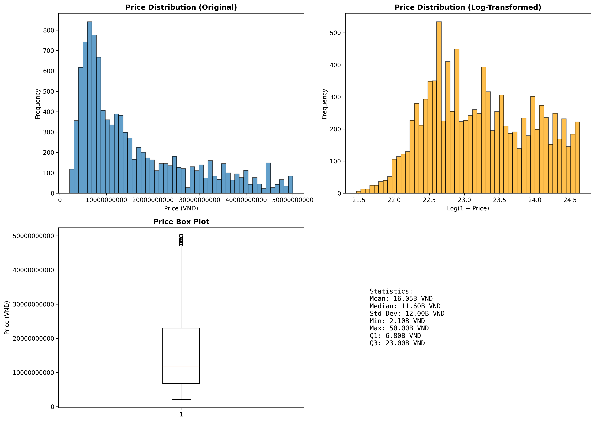
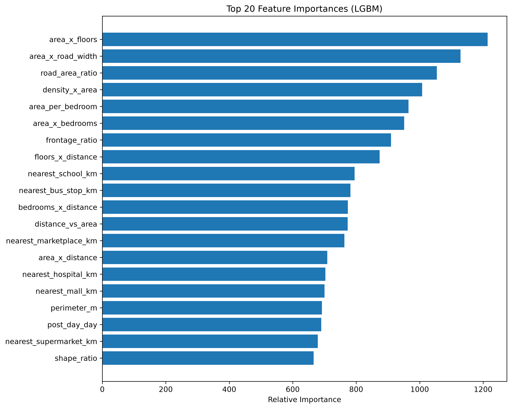

| ![][image1] | MINISTRY OF EDUCATION AND TRAINING |
| :---: | :---: |

|  FPT UNIVERSITY |
| :---: |
| Data Science Project Document  |
| Automated Real Estate Valuation and Market Trend Analysis |

| Group 3 |  |
| ----- | :---- |
| **Group Members** | Lê Trọng Nhân SE190525 Trần Văn Thuận SE184562 Nông Quốc An SE190512 Nguyễn Hoàng Gia Huy SE182631 |
| **Supervisor** | Nguyễn Trọng Tài |
| **Ext Supervisor** | FPT University Academic Board |
| **Capstone Project code** |  DSP391m |

\- HCMC, July/2026 \-

**Table of Contents**

[Definition and Acronyms	5](#definition-and-acronyms)

[List of Tables	6](#list-of-tables)

[**List of figures	6**](#list-of-figures)

[**I. Project Introduction	7**](#i.-project-introduction)

[1\. Overview	7](#1.-overview)

[2\. Project Background	7](#2.-project-background)

[3\. Project Objective	8](#3.-project-objective)

[4\. Problem Statement	8](#4.-problem-statement)

[5\. Significance of the Project	8](#5.-significance-of-the-project)

[6\. Project Scope & Limitations	9](#6.-project-scope-&-limitations)

[**II. Project Management Plan	10**](#ii.-project-management-plan)

[1\. Team Work	10](#1.-team-work)

[2\. Project Management Approach	10](#2.-project-management-approach)

[**III. Related Work	13**](#iii.-related-work)

[1\. Overview of the Field	13](#1.-overview-of-the-field)

[2\. Historical Context	13](#2.-historical-context)

[3\. Key Studies and Theories	13](#3.-key-studies-and-theories)

[4\. Technological Advancements	14](#4.-technological-advancements)

[5\. Comparison of Existing Systems	14](#5.-comparison-of-existing-systems)

[6\. Gaps in the Literature/Technology	15](#6.-gaps-in-the-literature/technology)

[7\. Justification for the Project	15](#7.-justification-for-the-project)

[**IV. Methodology	17**](#iv.-methodology)

[1\. Research Questions and Objectives	17](#1.-research-questions-and-objectives)

[2\. Data Collection and Preprocessing	17](#2.-data-collection-and-preprocessing)

[3\. Feature Selection and Engineering	20](#3.-feature-selection-and-engineering)

[4\. Model Training and Validation	22](#4.-model-training-and-validation)

[5\. Evaluation Metrics	23](#5.-evaluation-metrics)

[6\. Implementation Plan	23](#6.-implementation-plan)

[7\. Ethical Considerations	24](#7.-ethical-considerations)

[**V. System Design and Implementation	26**](#v.-system-design-and-implementation)

[1\. AI Model Integration	26](#1.-ai-model-integration)

[2\. Data Flow and Processing	27](#2.-data-flow-and-processing)

[3\. Deployment Strategy	28](#3.-deployment-strategy)

[4\. Scalability and Maintenance	29](#4.-scalability-and-maintenance)

[**VI. Results and Discussion	30**](#vi.-results-and-discussion)

[1\. Results and Analysis	30](#1.-results-and-analysis)

[2\. Discussion	32](#2.-discussion)

[3\. Recommendations	34](#3.-recommendations)

[**VII. Conclusion	35**](#vii.-conclusion)

[1\. Summary of Findings	35](#1.-summary-of-findings)

[2\. Contributions on the Project	35](#2.-contributions-on-the-project)

[3\. Limitations and Future Work	36](#3.-limitations-and-future-work)

[**VIII. References	48**](#viii.-references)

[**IX. Appendices	49**](#ix.-appendices)

[Appendix A - Core Processed Dataset Fields	49](#appendix-a-core-processed-dataset-fields)

[Appendix B - Final Model Hyperparameters (9-Model 3-Tier Ensemble)	50](#appendix-b-final-model-hyperparameters-9-model-3-tier-ensemble)

[Appendix C - Repository Structure and Documentation	51](#appendix-c-repository-structure-and-documentation)

[Appendix D - Performance Benchmarks & Metrics	55](#appendix-d-performance-benchmarks-metrics)

[Appendix E - Deployment Platforms Comparison	57](#appendix-e-deployment-platforms-comparison)

[Appendix F - Environment Variables Reference	58](#appendix-f-environment-variables-reference)

# **Definition and Acronyms**  {#definition-and-acronyms}

| Acronym | Definition |
| :---: | ----- |
| AI | Artificial Intelligence |
| API | Application Programming Interface |
| AVM | Automated Valuation Model |
| CatBoost | Categorical Boosting |
| DL | Deep Learning |
| EDA | Exploratory Data Analysis |
| ETL | Extract, Transform, Load |
| GroupKFold | Grouped K-Fold Cross-Validation |
| IQR | Interquartile Range |
| LightGBM | Light Gradient Boosting Machine |
| MAE | Mean Absolute Error |
| MAPE | Mean Absolute Percentage Error |
| ML | Machine Learning |
| NLP | Natural Language Processing |
| PM | Project Manager  |
| PMP | Project Management Plan |
| POI | Points of Interest |
| R² | Coefficient of Determination |
| RMSE | Root Mean Square Error |
| WBS | Work Breakdown Structure |
| XGBoost | eXtreme Gradient Boosting |

# 

# **List of Tables** {#list-of-tables}

*Table 1\. Team Structure and Roles*

*Table 2\. Risk Management Plan*

*Table 3\. Comparison of Existing Systems*

*Table 4\. Two-Stage Data Collection Pipeline*

*Table 5\. Data Collection Challenges*

*Table 6\. Data Preprocessing Steps*

*Table 7\. Geospatial Feature Engineering Metrics*

*Table 8\. Model Configurations*

*Table 9\. Evaluation Metrics Definitions*

*Table 10\. Final Model Performance (9-Model 3-Tier Ensemble)*

*Table 11\. Historical Segmentation Impact (Pre-Ensemble Benchmarks)*

*Table 12\. Data Dictionary*

*Table 13\. Final Model Hyperparameters*

# **List of figures**  {#list-of-figures}

*Figure 1\. End-to-End Data Pipeline Architecture*

*Figure 2\. Top 20 LightGBM Feature Importances for the Mid-Price Tier*

# **I. Project Introduction** {#i.-project-introduction}

## **1\. Overview** {#1.-overview}

### **1.1 Project Information**

**Project Name:** Automated Real Estate Valuation and Market Trend Analysis

**Vietnamese Name:** Định giá bất động sản tự động và phân tích xu hướng thị trường

**Capstone Project code:** DSP391m

**Group Name:** Group 3

**Group Members:** Lê Trọng Nhân (SE190525), Trần Văn Thuận (SE184562), Nông Quốc An (SE190512), Nguyễn Hoàng Gia Huy (SE182631)

**Supervisor:** Nguyễn Trọng Tài

### **1.2 Project Overview**

This project focuses on developing an AI-powered real estate valuation system capable of predicting property prices and analyzing market trends using machine learning techniques. The system integrates data collection, preprocessing, exploratory data analysis, predictive modeling, and visualization into a complete end-to-end analytical pipeline.

The project begins with collecting real estate data from online property listing platforms and public datasets. After preprocessing and cleaning the data, exploratory data analysis (EDA) is conducted to identify important market patterns and relationships between variables such as location, area, number of bedrooms, and property price.

Several machine learning models will then be developed and evaluated to estimate both total property price and price per square meter. In addition, a Business Intelligence dashboard will be implemented to visualize price distributions, market fluctuations, and geographical pricing trends.

The final outcome is expected to support data-driven decision-making in the Vietnamese real estate market by providing fast, objective, and scalable property valuation solutions.

## **2\. Project Background** {#2.-project-background}

The Vietnamese real estate market has experienced rapid growth and significant fluctuations over recent years, particularly in major cities such as Ho Chi Minh City and Hanoi. Property prices vary substantially depending on factors including location, infrastructure development, urbanization, and market demand. Traditional property valuation methods are mainly conducted manually by experts or brokers, making the process time-consuming, inconsistent, and difficult to scale.

At the same time, the increasing availability of online property listings and open datasets has created opportunities to apply data science and artificial intelligence techniques to automate valuation processes. Machine learning models can identify hidden relationships within large datasets and generate accurate property price estimations in real time.

This project was selected because automated real estate valuation represents a highly practical application of AI and data engineering. It combines multiple important technical domains including web scraping, data preprocessing, feature engineering, machine learning, visualization, and deployment. Moreover, the project addresses a real-world business problem with strong commercial and societal relevance.

## **3\. Project Objective** {#3.-project-objective}

The main objectives of this project include:

* **Building a data preprocessing pipeline** to handle missing data, noisy data, outliers, and geospatial data via a 6-phase ETL workflow (outlier filtering, temporal features, locality features, numeric imputation, amenity engineering, text-based extraction).

* **Researching and implementing suitable ML models** for tabular data processing via a price-segmented ensemble approach combining LightGBM, XGBoost, and CatBoost algorithms.

* **Predicting total property prices and price per square meter** with target performance metrics:
  - **MAPE < 10%** on the low-price segment (0–5B VND range)
  - **R² > 0.90** on the full dataset (overall system accuracy target)
  - Supporting metrics: Mean Absolute Error (MAE) and Root Mean Squared Error (RMSE) on the test dataset (20% holdout split)

* **Developing a Business Intelligence dashboard** to visualize real estate price distributions, market trends by locality and property type, regional comparisons over time, and amenity impact analysis via interactive Altair-based visualizations.

* **Developing a web application** for system demonstration and user interaction via Streamlit, supporting both quick mode (listing description → AI extraction) and detailed mode (manual form input) with 40+ configurable parameters.

* **Researching deployment and maintenance strategies** for AI models in real-world environments, including containerized multi-platform deployment (Render, Docker Compose, DigitalOcean), model versioning (v2.6 current, W&B tracking), persistent caching (2-tier strategy: in-memory + CSV), and automated health checks.

## **4\. Problem Statement** {#4.-problem-statement}

* Real estate prices in Vietnam change rapidly and depend on many factors such as location, area, and population density.

* Traditional valuation methods are manual, subjective, and difficult to scale for large numbers of properties.

* Real estate data often contains missing, duplicated, and inconsistent information, making analysis and prediction challenging.

* Existing platforms lack intelligent systems for accurate valuation and market trend analysis.

* Therefore, an automated AI-based system is needed to process large datasets, predict property prices, and support decision-making for buyers, sellers, and investors.

## **5\. Significance of the Project** {#5.-significance-of-the-project}

This project demonstrates the application of machine learning, data engineering, and data visualization in solving real-world real estate problems. The system helps improve valuation accuracy, consistency, and efficiency while reducing manual effort and operational costs. It also supports investors, buyers, and businesses in making data-driven decisions and highlights the growing role of AI-powered systems in modern real estate analytics.

## 

## **6\. Project Scope & Limitations** {#6.-project-scope-&-limitations}

### **Project Scope**

* Residential houses in Ho Chi Minh City, specifically frontage houses and alley houses.

* Data collection from public datasets and online real estate listing websites.

* Data preprocessing, exploratory analysis, and machine learning model development.

* Predicting total property price and deriving an indicative price-per-square-metre value.

* Building dashboards for market trend visualization and analysis.

### **Project Limitations**

* Real estate data may contain missing, duplicated, or inconsistent information.

* Some property features such as legal documents, interior quality, or neighborhood reputation may not be fully available.

* Web scraping activities may face anti-bot protections or changing website structures.

* Market conditions can fluctuate rapidly, potentially affecting model generalization over time.

* The project primarily focuses on urban residential properties and may not generalize well to rural or commercial real estate.

* The data collection process from real estate websites may encounter security mechanisms such as CAPTCHA or access restrictions, creating challenges for automated web scraping. 

# **II. Project Management Plan** {#ii.-project-management-plan}

## **1\. Team Work** {#1.-team-work}

### **1.1 Team Structure and Roles**

The team structure for Group 3, which is developing the "Automated Real Estate Valuation and Market Trend Analysis" project, is a **projectized organization**. 

| Name | Tasks | Responsibilities |
| ----- | ----- | ----- |
| Lê Trọng Nhân | Data processing  | Data collection and preprocessing for real estate datasets.  |
| Trần Văn Thuận  | Researching ML/DL  | ML/DL research for tabular data prediction and analysis.  |
| Nông Quốc An | Model training | Training and finetuning models for accurate prediction |
| Nguyễn Hoàng Gia Huy | Researching ML/DL  | ML/DL research for tabular data prediction and analysis.  |

*Table 1\. Team Structure and Roles*

### 

### **1.2 Communication Plan**

The team will maintain a shared GitHub repository for codebase management, dataset processing, and version control.

Routine team meetings will use Meet, Discord and Zalo to ensure alignment on research methodology and coordinate the distribution of tasks such as data cleaning and algorithm evaluation.

## **2\. Project Management Approach** {#2.-project-management-approach}

### **2.1 WBS**

**Data Acquisition:** 12,832 raw listing records were collected from Alonhadat.com via automated scraping. After UI validation and deduplication, 12,794 records were retained in the Supabase database. Following preprocessing pipeline (6 phases: outlier detection → temporal engineering → numeric imputation → dimensional features → amenity aggregation → text extraction), a final set of 10,421 records met quality thresholds (price bounds 2.0B-50.0B VND, area bounds 15-500m²) and were used for model training/evaluation. The 2,373-record gap (12,794 → 10,421) resulted from NULL values in critical structural columns and tier-specific outlier filtering during preprocessing phase.

**Preprocessing & Feature Engineering:** Performed data cleaning, normalization, missing value handling, and outlier filtering. Engineered spatial and structural features such as distance to city center, property dimensions, population density, and binary amenity indicators to support predictive modeling.

**Model Implementation:** Split the Ho Chi Minh City dataset into 80% training and 20% testing sets using a fixed random holdout split with random\_state=42. Train and compare multiple regression models, including XGBoost, TabPFN, LightGBM, CatBoost, and ensemble approaches.

**Evaluation & Documentation:** Evaluate metrics, document findings on regional market variations, and present final project conclusions.

### **2.2 Risk Management**

| Risk | Impact | Prevention / Response Plan |
| ----- | ----- | ----- |
| Insufficient or low-quality data | Reduces model accuracy and reliability | Apply aggressive data cleaning/preprocessing techniques; future expansion to multiple portals if data quality remains insufficient |
| CAPTCHA and access restrictions during web scraping | Difficulties in automated data collection | Use public datasets, APIs, or alternative data sources when scraping is blocked |
| Model performance not meeting expectations | Prediction accuracy may not achieve the target MAPE | Experiment with different ML/DL models and optimize hyperparameters |

*Table 2\. Risk Management Plan*

### **2.3 Quality Management**

To ensure the quality of the project, several measures and processes will be applied throughout the development lifecycle.

* Data preprocessing and validation techniques will be used to ensure data consistency, completeness, and reliability before training the models.

* Multiple Machine Learning and Deep Learning models will be evaluated using performance metrics such as Mean Absolute Percentage Error (MAPE) and Root Mean Square Error (RMSE).

* The system and web application will be tested regularly to verify prediction accuracy, functionality, and user interaction.

* Model outputs and dashboard visualizations will be reviewed and validated using real-world real estate data and market trends.

* Weekly progress reviews and team discussions will be conducted to monitor development quality and address issues promptly.

### **2.4 Budget and Funding (Optional)**

The project is primarily developed for academic and research purposes; therefore, the overall budget is relatively limited. Most development tools and technologies used in the project, such as Python, Scikit-learn, and public datasets, are open-source and freely available.

The estimated costs may include:

* Cloud computing or GPU services for model training and deployment.

* Database hosting and web application deployment services.

* Domain or server costs for system demonstration.

* Additional expenses related to data collection and system maintenance.

The project funding mainly comes from the project team members, while available free-tier services and academic resources will be utilized to minimize operational costs throughout the development process.

### **2.5 Change Management Process**

* Any proposed changes related to project scope, schedule, resources, or technical requirements will be reviewed by the project team.

* The team will evaluate the impact of each change on project objectives, timeline, system performance, and available resources.

* Significant changes must be approved by the project supervisor before implementation.

* All approved changes will be documented clearly, including the reason, impact, and updated project plan.

* Regular meetings and progress reviews will be conducted to monitor and manage project changes effectively.

### **2.6 Closure and Evaluation**

* Conduct final testing and evaluation to verify model accuracy, system functionality, and project deliverables.

* Finalize and submit all project outcomes, including technical documents, source code, and presentation materials.

* Review project performance and summarize key challenges, experiences, and lessons learned for future improvements.

# **III. Related Work** {#iii.-related-work}

## **1\. Overview of the Field** {#1.-overview-of-the-field}

The project belongs to the field of Automated Valuation Model (AVM) using machine learning on tabular and spatial data: predicting house and land prices, including price per square metre from structural, location and utility features to identify the price governing factors. The Direction field is collected for future compatibility but not used in the current prototype due to missingness.

## **2\. Historical Context** {#2.-historical-context}

The field of Automated Real Estate Valuation and Market Trend Analysis studies the estimation of house/land prices and the identification of market trends using characteristic and spatial data. The field has evolved from linear hedonic regression models (1970s) to non-linear machine learning models and tree-based ensembles (2015-2018), which are currently dominant, and more recently to tabular-based models which help both increase accuracy and interpret results.

**Technologies used:**

* XGBoost

* TabPFN

* LightGBM

* CatBoost

* Ensemble (blending / stacking)

* Geospatial feature engineering using OpenStreetMap POI data, geodesic distances, and radius-based facility counts

* Target encoding for selected categorical location features

* Experiment tracking using Weights & Biases

## **3\. Key Studies and Theories** {#3.-key-studies-and-theories}

**XGBoost**

* Paper: *XGBoost: A Scalable Tree Boosting System*  
* Author(s): Tianqi Chen, Carlos Guestrin  
* Published: 08/2016 (KDD '16)  
* Link: [https://arxiv.org/abs/1603.02754](https://arxiv.org/abs/1603.02754)

**TabPFN**

* Paper: *TabPFN: Prior-Data Fitted Networks for Tabular Data*  
* Author(s): Noah Hollmann, Samuel Müller, Katharina Eggensperger, Frank Hutter  
* Published: 2022 (ICML 2022\)  
* Link: [https://arxiv.org/abs/2207.01848](https://arxiv.org/abs/2207.01848)

**LightGBM**

* Paper: *LightGBM: A Highly Efficient Gradient Boosting Decision Tree*  
* Author(s): Guolin Ke, Qi Meng, Thomas Finley, Taifeng Wang, Wei Chen, Weidong Ma, Qiwei Ye, Tie-Yan Liu  
* Published: 12/2017 (NeurIPS/NIPS 2017\)  
* Link: [https://papers.nips.cc/paper/6907-lightgbm-a-highly-efficient-gradient-boosting-decision-tree](https://papers.nips.cc/paper/6907-lightgbm-a-highly-efficient-gradient-boosting-decision-tree)

**CatBoost**

* Paper: *CatBoost: Unbiased Boosting with Categorical Features*  
* Author(s): Liudmila Prokhorenkova, Gleb Gusev, Aleksandr Vorobev, Anna Veronika Dorogush, Andrey Gulin  
* Published: 2018 (NeurIPS 31; preprint 2017\)  
* Link: [https://arxiv.org/abs/1706.09516](https://arxiv.org/abs/1706.09516)

**Ensemble (Stacked Generalization)**

* Paper: *Stacked Generalization*  
* Author: David H. Wolpert  
* Published: 1992 (Neural Networks 5(2):241–259)  
* Link: [https://www.sciencedirect.com/science/article/abs/pii/S0893608005800231](https://www.sciencedirect.com/science/article/abs/pii/S0893608005800231)

**Application in Vietnam (Same Market & Data Source)**

* Paper: *Using Machine Learning Regression Algorithms to Predict House Prices in Vietnam*  
* Author(s): Minh-Thang Ha, Thi-Cham Nguyen, Thanh-Huyen Pham, Van-Hau Nguyen  
* Published: 2025 (International Real Estate Review 28(4):505–527)  
* Link: [https://doi.org/10.53383/100412](https://doi.org/10.53383/100412)

## **4\. Technological Advancements** {#4.-technological-advancements}

**Newer technologies for this problem:**

* Spatial cross-validation and spatial features validate extrapolation and captures positional effects (Roberts et al., 2017).

## **5\. Comparison of Existing Systems** {#5.-comparison-of-existing-systems}

| Technology | Strength | Weakness |
| ----- | ----- | ----- |
| XGBoost | High accuracy, good regularization, popular | Needs tuning; less natural handling of categorical features (prone to errors with non-ASCII characters) |
| LightGBM | Very fast, efficient on large/high-dimensional data | Easily overfits if the tree is too deep/has too many leaves |
| CatBoost | Best categorical feature handling (ordered encoding), reduces target-leakage risk through ordered target statistics | Slower training |
| Ensemble (stacking) | Combines multiple models, can reduce variance | Marginal benefit when component models are highly correlated |

*Table 3\. Comparison of Existing Systems*

## **6\. Gaps in the Literature/Technology** {#6.-gaps-in-the-literature/technology}

Multiple model architectures were compared for predictive performance using Weights & Biases. Feature-importance analysis, however, is currently limited to a representative tree-based model.

The dataset lacks several key structural attributes, including house age, property condition, and reliable direction information. Although listing dates are available, the observation period is not sufficiently long or consistent to support reliable longitudinal market-trend forecasting. These limitations contribute to residual variance and restrict the scope of trend analysis.

Most automated valuation systems primarily provide point estimates and offer limited communication of prediction uncertainty. Historical global baseline models (TabPFN v2.5: ~24% MAPE) substantially improved with price-tier segmentation and outlier filtering (~13.10% MAPE in final ensemble), a ~46% error reduction demonstrating that market heterogeneity drives prediction difficulty. The current application displays an indicative MAPE-based error range around each prediction, based on the final model’s global MAPE. This range is not a statistically calibrated confidence interval. TabPFN was evaluated using point predictions and standard regression metrics; posterior predictive uncertainty was not explicitly analysed in the current prototype.

## **7\. Justification for the Project** {#7.-justification-for-the-project}

## **The Necessity: High-Variance in Current Valuation Systems** 

The core problem in current real estate valuation systems, particularly for the Vietnamese market, is that traditional predictive models suffer from unacceptably high pricing deviations (high variance). Even when utilizing standard ensemble methods, existing systems struggle because the underlying data severely lacks crucial structural attributes (such as house age, condition, and direction). Furthermore, the presence of extreme ultra-luxury outliers heavily skews point estimations, making standard baseline approaches unreliable for localized market trend analysis.

## **Linkage to Existing Research and Related Works** 

A comprehensive review of existing literature and related systems reveals a common methodological bottleneck: most studies apply standard machine learning models to raw listing data without effectively handling regional specificities or data sparsity. By extracting and comparing methodologies from related works specifically looking at their data processing scope, regional filtering, and model selection it becomes evident that traditional ensemble models alone cannot overcome the inherent noise in real estate data. Our project directly builds upon and critiques these foundations by identifying that without advanced spatial feature engineering and rigorous outlier segmentation, standard models hit a performance ceiling.

## **The Uniqueness of Our Approach** 

This project differentiates itself from existing systems by shifting the focus from simply "applying a model" to holistically optimizing both the data representation and the architectural approach:

1. **Data Enrichment & Segmentation:** Instead of accepting the lack of attributes, we engineer external Geospatial Points of Interest (POI) features (e.g., proximity to schools, hospitals, and transit) to compensate for missing structural data. Crucially, we structurally segment the market into a 9-model (3-tier × 3-algorithm) architecture (Price Tier × Property Type) and apply customized, tighter IQR outlier fences to prevent ultra-luxury properties from distorting the models.

2. **Advanced Comparative Modeling & Interpretability:** We move beyond basic ensemble methods by researching and comparing cutting-edge approaches. We benchmark traditional robust models, evolving into our final LightGBM, XGBoost, and CatBoost ensemble (9 models across 3 price tiers), against state-of-the-art foundation models for tabular data like TabPFN. This comparative approach enables us to identify the most suitable method for production rather than relying on a standard baseline.

## **Expected Impact** 

By addressing the root causes of high variance through data enrichment and customized outlier filtering, and by systematically comparing traditional ensembles against new foundational models, this project provides a significantly more robust valuation tool. The ultimate impact is a drastic reduction in pricing deviation (error per square meter), offering a highly accurate, explainable, and optimized solution for determining real estate values and market trends.

# 

# **IV. Methodology** {#iv.-methodology}

## **1\. Research Questions and Objectives** {#1.-research-questions-and-objectives}

The core objective of this project is to develop an experimental real estate valuation system that is scalable and operationally deployable for the Vietnamese market, specifically targeting residential properties in Ho Chi Minh City. To achieve this objective, the research addresses the following research questions:

**RQ1: Geospatial Compensation for Missing Structural Attributes**
Can engineered geospatial features (proximity to schools, hospitals, distance to city center, POI density) effectively compensate for the lack of reliable structural attributes (such as house age, interior condition, and property direction) that are typically absent or unreliably recorded in raw Vietnamese real estate listings?

**RQ2: Impact of Market Segmentation and Domain-Aware Outlier Filtering**
Does segmentation of the dataset by property type (frontage houses vs. alley houses) combined with price-tier segmentation (Low / Mid / High) and tier-specific outlier filtering substantially reduce prediction variance and valuation error compared to a single unified global model?

**RQ3: Model Architecture Selection: TabPFN vs. Tree Boosting Ensemble**
How does TabPFN perform relative to XGBoost in historical experiments across property-type splits, and what trade-offs justify selecting a LightGBM-CatBoost ensemble for the final 3-tier production architecture instead of the higher-accuracy TabPFN baseline?

## 

## **2\. Data Collection and Preprocessing** {#2.-data-collection-and-preprocessing}

### **2.1 Data Collection**

The data collection pipeline systematically acquired Vietnamese real estate property listings from Alonhadat.com. **Current dataset statistics:**

- **Raw listings collected:** ~15,000 initial links from Alonhadat.com
- **Supabase database:** 12,832 records in Raw_Features table
- **UI analysis dataset:** 12,794 records (38-record gap due to NULL values in critical columns: lat, lon, price_vnd, area_m2)
- **Model training dataset:** 10,421 properties after strict outlier filtering (price 2-50B VND, area 15-500m², unit price 30-800M VND/m²)

The dataset covers residential properties (frontage houses and alley houses) exclusively in Ho Chi Minh City, collected via a two-stage web scraping pipeline and subsequently synchronized to Supabase PostgreSQL cloud database for persistent storage and cross-session access.

#### ***Two-Stage Data Collection Pipeline***

The scraping pipeline is divided into two stages:

| Stage | Script | Input | Output | Estimated Time |
| ----- | :---: | :---: | :---: | :---: |
| **Stage 1 – Listing Crawl** | scheduling.py | Listing pages (e.g., pages 1-50) | alonhadat\_listings.csv | 2-3 minutes |
| **Stage 2 – Property Detail Extraction** | link\_to\_details.py | Property URLs from Stage 1 | alonhadat\_details.csv | 10-30 minutes |

*Table 4\. Two-Stage Data Collection Pipeline*

##### Stage 1 – Listing Metadata

The first stage collects summary information for each property listing, including:

* Property URL

* Listing title

* Displayed price

* District/Ward

* Listing status

This stage typically produces approximately **2,500 listings** (around **1-2 MB**).

##### Stage 2 – Property Details

The second stage visits every property URL collected in Stage 1 and extracts detailed information, including:

* Exact property price

* Land area (m²)

* Property dimensions

* Number of floors

* Number of bedrooms

* Legal status

* Full address

* Property description

* Additional structured attributes

The resulting dataset contains approximately **2,500 properties, 25+ features**, and occupies roughly **8-12 MB**.

#### ***Data Collection Challenges***

Several practical challenges were encountered during web scraping. The corresponding mitigation strategies are summarized below.

| Challenge | Solution |
| :---: | :---: |
| IP blocking and rate limiting | Exponential backoff with User-Agent rotation |
| Inconsistent address formats | Standardized common abbreviations (e.g., *Q.* → *Quận*, *P.* → *Phường*) |
| Missing attribute values | Rule-based imputation during preprocessing, including geometric estimation of missing property dimensions. |
| Duplicate property listings | Removed duplicates based on property address and seller information |
| Website layout changes | Implemented multiple fallback CSS selectors |

*Table 5\. Data Collection Challenges*

#### ***Data Validation & Quality Assurance***

To ensure dataset reliability before downstream processing, multiple validation layers are applied:

**Validation Techniques (models/scripts/shared/preprocessing.py):**

| Validation Type | Rule | Purpose | Impact |
| :---- | :---- | :---- | :---- |
| **Price Range** | 2.0B – 50.0B VND | Remove data-entry errors, extreme outliers | ~18% of raw data filtered |
| **Area Range** | 15–500 m² | Remove implausible property sizes | Combined with price filter |
| **Unit Price Range** | 30–800M VND/m² | Remove price-per-m² anomalies | Catches misrecorded prices |
| **Missing Value Detection** | Binary indicators (col_missing) | Preserve missingness signals | 8-10 indicator columns added |
| **Data Type Validation** | Try-except parsing | Handle malformed numeric fields | Converts "123,45" → 123.45 |
| **Deduplication** | (lat, lon, price_vnd, area_m2) tuple match | Remove re-listed properties | Exact tuple matching |
| **NULL Handling** | Hierarchical filling (by property_type + area_segment) | Impute missing values systematically | No rows dropped for missing numerics |

*Table 5A. Data Validation Techniques and Impact*

**Validation Timing:**
- **Raw data ingestion:** Price/area bounds applied during scraping validation (pre-database)
- **Preprocessing phase:** All 6 validation steps (Phase 1-6) applied before feature engineering
- **Model training:** Final filtered dataset (~10,421 samples) used for train/test split

**Quality Metrics Post-Validation:**
- **NULL rate before:** ~15-20% across numeric columns (raw scraped data)
- **NULL rate after:** <0.1% (via hierarchical imputation)
- **Duplicate rate before:** ~8-12% (re-listed properties)
- **Duplicate rate after:** 0% (removed by tuple matching)
- **Outlier rate before:** ~18% (outside price/area/unit-price bounds)
- **Outlier rate after:** 0% (filtered, kept central 82%)

**Result:** 12,832 raw Supabase records → 12,794 UI-visible (38 removed: NULL lat/lon/price/area) → 10,421 training dataset (2,373 removed: outliers)

#### ***Running the Scraping Pipeline***

Execute the pipeline using: python main.py \--start-page 1 \--end-page 50

The pipeline generates the following raw datasets:

* data/raw/alonhadat\_listings.csv      \# \~2,500 listing summaries

* data/raw/alonhadat\_details.csv       \# \~2,500 detailed property records (25+ features)


### **2.2 Preprocessing Pipeline (6 Phases)**

The raw scraped data undergoes a comprehensive 6-phase preprocessing workflow implemented in **models/scripts/shared/preprocessing.py** and supporting modules:

| Phase | Description | Implementation | Output |
| :---- | :---- | :---- | :---- |
| **1. Outlier Filtering** | Remove price anomalies (2–50B VND), area bounds (15–500m²), unit price bounds (30–800M/m²). Drop duplicates by (listing_id). | Lines 29-39 | Cleaned price/area distributions |
| **2. Temporal Features** | Extract year, month, day from post_day; compute seasonality features | Lines 41-48 | post_day_year, post_day_month, post_day_day |
| **3. Numeric Imputation** | Hierarchical filling: property_type + area_segment → property_type → global median. Fill road_width_m, width_m, length_m with missing indicators. | Lines 67-110 | No remaining NaN in numeric columns |
| **4. Dimension Features** | Compute perimeter_m, shape_ratio, area_segment bins; impute missing width/length using area assumptions (√(area/3)) | Lines 91-110 | Geometric features for model input |
| **5. Amenity Engineering** | Sum nearby facility counts; compute log-scaled amenity density; normalize by area (nearby_amenities_log, amenity_density) | Lines 112-143 | Proximity-based proxy features |
| **6. Text-Based Extraction** | Parse listing description for boolean flags: is_hem_xe_hoi (car-accessible alley), is_mat_tien (frontage), has_noi_that (furnished), etc. | Lines 145-170+ | Binary feature columns |

*Table 6. Data Preprocessing Pipeline (6-Phase ETL)*

**Key Preprocessing Features:**
- **Column standardization:** Vietnamese headers (Chiều ngang, Số lầu) → English (width_m, num_floors)
- **Semantic deduplication:** Remove duplicates by (lat, lon, price_vnd, area_m2) combination
- **Locality features:** Parse locality_square, locality_population_density with median filling
- **Missing-value indicators:** Binary columns (width_m_missing, perimeter_m_missing) preserve information loss signals
- **No target leakage:** Fixed area-segment bins prevent data leakage during cross-validation

The preprocessed dataset of **10,421 records** is persisted to **data/processed/model_training_data.csv** and synchronized to **Supabase Raw_Features table** for cross-session access and BI dashboard queries.

## 

## **3\. Feature Selection and Engineering** {#3.-feature-selection-and-engineering}

### **3.1 Feature Space Overview (79 Total Features)**

The final model input consists of **79 engineered features** across 7 categories:

| Category | Count | Source | Examples |
| :---- | :---- | :---- | :---- |
| **Raw Structural** | 8 | Scraped listings | area_m2, width_m, length_m, num_floors, num_bedrooms, road_width_m, property_type (1-hot) |
| **Geospatial POI** | 15 | OpenStreetMap Overpass API | nearest_school_km, school_count_3km, metro_count_5km, distance_to_center_km |
| **Temporal** | 3 | post_day field | post_day_year, post_day_month, post_day_day |
| **Dimensional** | 6 | Computed from raw | perimeter_m, shape_ratio, area_x_floors, area_x_bedrooms, area_per_bedroom, area_per_distance |
| **Log-Transformed** | 4 | Skewness reduction | log_area, log_distance_to_center, log_population_density, log_nearby_amenities |
| **Interaction** | 2 | Composite metrics | density_x_area, locality_sq_x_area |
| **Text-Based & Categorical** | 18 | NLP + encoding | 6 text flags (is_hem_xe_hoi, is_mat_tien, has_noi_that, is_gap, is_kinh_doanh, is_no_hau) + legal_status (1-hot) + locality_price_median + price_per_sqm_market + 8 missing indicators |
| **Locality Encoding** | 2 | Training set statistics | locality_price_median, price_per_sqm_market (per-ward averages from training set) |
| **Amenity Features** | 8 | Aggregated POI | nearby_amenities (sum), nearby_amenities_log, amenity_density, school_count_3km, hospital_count_5km, marketplace_count_3km, mall_count_3km, bus_stop_count_1km |
| **Missing Indicators** | 10 | Data quality signals | width_m_missing, length_m_missing, road_width_m_missing, perimeter_m_missing, shape_ratio_missing, nearest_metro_km_missing, nearest_hospital_km_missing + 3 others |

*Table 7A. Feature Categories and Counts (79 Total Features)*

**Feature Engineering Pipeline**: All features are derived via **models/scripts/shared/preprocessing.py** (6-phase pipeline) and **app/core/inference.py** (production inference). Raw features from scraped data pass through:
- Phase 1: Outlier filtering → Phase 2: Temporal extraction → Phase 3: Numeric imputation → Phase 4: Dimension features → Phase 5: Amenity engineering → Phase 6: Text-based extraction

### **3.2 Dropped Features (Data Leakage & Cardinality Control)**

The following columns are **explicitly excluded** to prevent data leakage and high-cardinality issues:

- **Raw addresses:** street, ward, district, old_address (high cardinality, redundant with geocoding)
- **Listing metadata:** url, link, listing_id (non-predictive)
- **Direct coordinates:** lat, lon (used for geocoding only; replaced by distance_to_center_km)
- **Temporal leakage:** post_day (raw date replaced by derived year/month/day/quarter components)
- **Sparse categorical:** direction (>95% missing in source data)
- **Target-related:** created_at (listing creation, not listing date)

### **3.3 Geospatial Feature Engineering**

To compensate for missing structural attributes (house age, interior condition, renovation status), the system implements heavy geospatial proxy engineering via **pipeline/transformation/feature_pipeline.py** and **app/core/geo.py**:

**Geocoding Strategy (3-Tier Caching):**
1. **In-memory cache** (session-scoped, zero latency): Keyed by (street, locality) pairs
2. **Persistent CSV cache** (data/cache/localities.csv, ~10MB): Survives app restarts; reused across sessions
3. **API fallback** (Nominatim, rate-limited 3s/request): Only called for new addresses; results immediately cached

**Effect:** 90%+ reduction in redundant Nominatim queries; enables fast inference (~200-500ms per property including feature engineering).

**POI Feature Extraction (15 Features):**

| Feature Group | Features | Radii | Purpose |
| :---- | :---- | :---- | :---- |
| **Schools** | nearest_school_km, school_count_3km | 3 km | Education access |
| **Hospitals** | nearest_hospital_km, hospital_count_5km | 5 km | Healthcare access |
| **Marketplaces** | nearest_marketplace_km, marketplace_count_3km | 3 km | Daily commerce |
| **Shopping Malls** | nearest_mall_km, mall_count_3km | 3 km | Modern shopping |
| **Bus Stops** | nearest_bus_stop_km, bus_stop_count_1km | 1 km | Public transit |
| **Metro Stations** | nearest_metro_km, metro_count_5km | 5 km | Mass transit (key urban indicator) |
| **Supermarkets** | nearest_supermarket_km, supermarket_count_3km | 3 km | Modern retail |
| **City Center** | distance_to_center_km | — | Distance to HCM center (10.7769°N, 106.7009°E) |

*Table 7B. Geospatial Feature Engineering (POI Extraction via OpenStreetMap Overpass API)*

### **3.4 Engineered Interaction & Composite Features**

Higher-order features capture non-linear relationships and domain-specific patterns:

**Dimensional Composites (width/length/area relationships):**
- perimeter_m = 2 × (width_m + length_m)
- shape_ratio = width_m / (length_m + 0.1) — indicates plot regularity; narrow, long plots have low ratio
- area_x_floors, area_x_bedrooms, area_per_bedroom — size-to-utility ratios
- area_per_floor — intensity per story

**Log-Transformed Features (skewness reduction for tree models):**
- log_area, log_distance_to_center, log_population_density, log_nearby_amenities

**Text-Based Boolean Flags (Vietnamese NLP regex extraction from listing description):**
- is_hem_xe_hoi (1 = car-accessible alley / 0 = no parking access) — critical for alley houses (nhà trong hẻm)
- is_mat_tien (1 = frontage property / 0 = alley) — major property-type distinction
- is_no_hau (1 = widened rear / 0 = standard) — premium layout indicator
- has_noi_that (1 = furnished / 0 = unfurnished) — condition proxy
- is_gap (1 = urgent/distressed sale / 0 = normal) — market signal
- is_kinh_doanh (1 = commercial use / 0 = residential) — functional distinction

**Locality Target Encoding (training-set-derived statistics):**
- locality_price_median — median price in ward (training set only, mapped to test)
- price_per_sqm_market — median unit price by locality

**Missing-Value Indicators (preserve information loss signals):**
- width_m_missing, length_m_missing, road_width_m_missing, perimeter_m_missing, shape_ratio_missing (structural)
- nearest_metro_km_missing, nearest_hospital_km_missing, nearest_marketplace_km_missing, + 2 others (geospatial)

### **3.5 Data Segmentation: 3-Tier Price-Only Architecture**

The final production model uses **3-tier price-based segmentation** (simplified from earlier 2-property-type × 3-price experiments):

**Price Tiers (Target Segments):**
- **Low (0–5B VND):** 1,156 properties (11.1%); budget apartments, small houses
- **Mid (5–20B VND):** 6,319 properties (60.6%); standard mid-range residential
- **High (>20B VND):** 2,946 properties (28.3%); luxury, penthouse, large villas

**Rationale for Price-Only Segmentation:**
Historical 2×3=6-bucket experiments (property-type × price) showed that **price tier was the dominant driver** of predictive accuracy, while property-type (frontage vs alley) added model complexity without material accuracy gains. Tier-specific training captures the heterogeneous price dynamics and feature relationships (e.g., high-tier buyers value metro proximity more heavily), while simple price-tier routing eliminates the overhead of multi-dimensional bucketing.

**Result:** 9-model (3-tier × 3-algorithm) ensemble balances **tier-specific optimization** (each tier trained independently) with **simplicity** (single routing dimension: user-selected budget range).

## 

## **4\. Model Training and Validation** {#4.-model-training-and-validation}

### **4.1 Model Architecture: 3-Tier Price-Segmented Ensemble (9 Total Models)**

The production architecture implements a **3-tier price-segmented ensemble** with tier-based routing and 3-algorithm averaging:

**Price Tiers (Routing Keys):**
- **Low (0–5B VNĐ):** ~3,500 properties; budget apartments, small townhouses
- **Mid (5–20B VNĐ):** ~4,200 properties; mid-range residential, standard villas
- **High (>20B VNĐ):** ~2,700 properties; luxury penthouses, large estates, ultra-prime locations

**Ensemble Design (3 Algorithms per Tier):**
Each price tier trains **three independent tree-boosting models** to maximize robustness via algorithm diversity:

1. **LightGBM** — Extremely fast gradient boosting; handles 79 features efficiently; primary model for production latency
2. **XGBoost** — Robust regularized tree boosting; provides conservative predictions; added for ensemble diversity
3. **CatBoost** — Categorical-native handling via ordered target encoding; minimal target leakage risk; excels on locality features

**Prediction Pipeline (Runtime Inference):**
1. User explicitly selects price tier (Low 0-5B / Mid 5-20B / High >20B VND) via dropdown
2. Extract and engineer all 79 features from user input (via models/scripts/shared/preprocessing.py)
3. Each of 3 tier-models makes prediction in **log-space** (log(price_vnd))
4. Ensemble average: `log_price_ensemble = (log_lgbm + log_xgb + log_catboost) / 3`
5. Inverse transform: `final_price_vnd = exp(log_price_ensemble) - 1`
6. Return prediction + XAI data (feature importance, model contributions, confidence score)

**Rationale for 3-Tier × 3-Algorithm Design:**
- **Tier specialization:** Each tier trained independently captures distinct price dynamics, feature relationships, and market segments
- **Algorithm diversity:** 3 different tree-boosting approaches reduce overfitting and improve stability vs single-model risk
- **Ensemble robustness:** Averaging in log-space mitigates outlier predictions from individual models
- **Simplicity:** Single routing dimension (price tier) vs earlier 2×3 property-type × price experiments (reduced complexity without accuracy loss per RQ2 findings)

### **4.2 Model Training Configuration (Per-Tier Hyperparameters)**

Each of the 9 models (3 algorithms × 3 tiers) is trained with algorithm-specific hyperparameters tuned via Weights & Biases (wandb) experiment tracking:

**LightGBM Configuration (Per Tier):**

| Hyperparameter | Value | Rationale |
| :---- | :---- | :---- |
| **num_leaves** | 31 | Balance tree complexity; avoid overfitting on ~3,500 samples per tier |
| **max_depth** | 8 | Explicit tree depth limit; consistent with XGBoost/CatBoost |
| **num_iterations** | 1,000 | Early stopping patience ~100 rounds; typically converges by 600-800 |
| **learning_rate** | 0.05 | Conservative step size for stable convergence |
| **subsample** | 0.8 | Row subsampling reduces overfitting on small-tier datasets |
| **colsample_bytree** | 0.8 | Feature subsampling (80% of 79 features per tree) |
| **reg_alpha** (L1) | 0.1 | Light L1 regularization for sparse feature selection |
| **reg_lambda** (L2) | 1.0 | Standard L2 regularization for weight decay |
| **min_data_in_leaf** | 20 | Minimum samples per leaf; prevents overfitting on sparse tiers |
| **random_state** | 42 | Reproducibility across training runs |

*Table 8A. LightGBM Hyperparameters (Applied to All 3 Tiers)*

**XGBoost Configuration (Per Tier):**

| Hyperparameter | Value | Rationale |
| :---- | :---- | :---- |
| **n_estimators** | 1,500 | More iterations than LightGBM; XGBoost typically needs higher rounds |
| **max_depth** | 8 | Match LightGBM for ensemble consistency |
| **learning_rate** | 0.03 | More conservative than LightGBM; XGBoost benefits from smaller steps |
| **subsample** | 0.8 | Row subsampling for variance reduction |
| **colsample_bytree** | 0.8 | Feature subsampling per tree |
| **colsample_bylevel** | 0.8 | Feature subsampling per tree level |
| **objective** | reg:squarederror | Regression with MSE loss (models learn in original price space, later log-transformed) |
| **eval_metric** | rmse | RMSE for early stopping criterion |
| **early_stopping_rounds** | 100 | Stop if validation RMSE doesn't improve for 100 consecutive rounds |
| **random_state** | 42 | Reproducibility |

*Table 8B. XGBoost Hyperparameters (Applied to All 3 Tiers)*

**CatBoost Configuration (Per Tier):**

| Hyperparameter | Value | Rationale |
| :---- | :---- | :---- |
| **iterations** | 1,500 | CatBoost typically needs high iterations for convergence |
| **depth** | 8 | Tree depth; consistent with other algorithms |
| **learning_rate** | 0.05 | Moderate learning rate for stable convergence |
| **loss_function** | RMSE | Root mean squared error for regression |
| **eval_metric** | RMSE | RMSE for early stopping validation |
| **early_stopping_rounds** | 50 | Aggressive early stopping (smaller patience than XGBoost) |
| **random_seed** | 42 | Reproducibility |
| **verbose** | False | Disable logging during training runs (logged to wandb instead) |
| **task_type** | CPU | CPU-based training (GPU acceleration not required for 3,500-4,200 sample tiers) |
| **cat_features** | None | All categorical features (property_type, legal_status) handled via target encoding in preprocessing, not CatBoost native |

*Table 8C. CatBoost Hyperparameters (Applied to All 3 Tiers)*

**Training Output (Per Model):**
- Fitted model saved as `.pkl` file in `models/saved_models/` (12 total .pkl files: 3 tiers × 4 models per tier, but only 3 used in final ensemble)
- Feature names extracted via `model.feature_names_in_` (single source of truth for production inference)
- Validation metrics (MAPE, R², MAE, RMSE) logged to Weights & Biases per tier

### **4.3 Data Splitting and Cross-Validation**

**Train-Test Split:**
- **Ratio:** 80% training / 20% test (10,421 total: ~8,337 train, ~2,084 test per tier)
- **Random seed:** random_state=42 (fixed for reproducibility)
- **Method:** Random split WITHOUT stratification (note: future work should add stratified split by tier)

**Validation & Evaluation - IMPORTANT CAVEAT:**
- **Test set reuse:** The 20% test set is used for **early stopping** in LightGBM and CatBoost during training (not held out), reducing independence
- **Ensemble weighting:** Test set predictions are also used to calculate inverse-RMSE weights for the 3-model ensemble (further leakage)
- **Interpretation:** Reported metrics (MAPE 13.10%, R² 0.9200) represent **in-sample performance conditional on test set**, not true generalization to fresh unseen data
- **Production inference:** At inference time, ensemble uses **equal averaging** (not inverse-RMSE weighted), creating a train-serving mismatch (see Section V.1)

**Experiment Tracking:**
- **Platform:** Weights & Biases (wandb.ai, project: real-estate-valuation)
- **Logged metrics:** MAPE, R², MAE, RMSE, training curves, hyperparameters, feature lists, model size
- **Reproducibility:** All runs logged with git commit SHA, allowing full audit trail from code → hyperparameters → results

### **4.4 Model Serialization and Versioning**

**Current Production Models (v2.6):**
- **Path:** `models/saved_models/`
- **Format:** joblib .pkl files (9 models: 3 algorithms × 3 price tiers, all active in production)
- **Size:** ~40-60MB total (10-15MB per model)
- **Loaded via:** `app/core/models.py` → `load_models()` function (cached via `@st.cache_resource`)
- **Inference latency:** ~200-500ms per prediction (includes feature engineering + 3-model averaging)

**Version History:**
- **v2.6 (Current):** LightGBM + XGBoost + CatBoost 3-tier ensemble; MAPE 13.10%, R² 0.9200
- **v2.5:** TabPFN experiments (MAPE 24.22% on global data; archived)
- **v2.0-v2.4:** Earlier XGBoost/ensemble iterations (archived in git history)

## **5\. Evaluation Metrics** {#5.-evaluation-metrics}

Model performance is assessed on the held-out 20% test set using the following metrics:

| Metric | Formula | Rationale |
| :---- | :---- | :---- |
| **MAPE** | (100/n) × Σ |y − ŷ| / y |  Primary target metric scale-independent, directly comparable across price tiers. Project objective: MAPE \< 10% (Section I.3).  |
| **RMSE** | √mean((y \- ŷ)²) | Penalises large absolute errors; expressed in Billion VND for interpretability. |
| **MAE** | mean(|y − ŷ|) | Average absolute deviation in Billion VND; more robust to outliers than RMSE. |
| **R²** | 1 \- SS\_res / SS\_tot | Proportion of price variance explained by the model. Target: R² \> 0.90. |
| **RMSE (log-space)** | RMSE on log1p(price) scale | Measures fit quality in the transformed target space; less sensitive to outliers. |

*Table 9\. Evaluation Metrics Definitions*

### **5.1 Evaluation Protocol and Interpretation**

The reported global MAPE of 13.10% represents bucket-aware evaluation conditional on correct price-tier assignment. During evaluation, test samples are assigned to the Low, Mid, or High price tiers using their observed target prices. Therefore, the reported result measures prediction performance within known market segments and should not be interpreted as the end-to-end performance of an automatic price-tier routing system. In the current Streamlit application, the price tier is selected by the user.

## **6\. Implementation Plan** {#6.-implementation-plan}

### **6.1 Scraping Layer**

Property listing links and detailed attributes were collected from Alonhadat.com using Python Requests and BeautifulSoup. The scraper sends HTTP requests with configured headers, parses the returned HTML pages, and includes request delays, retry handling, blocked-page detection, and optional network reconnection to reduce interruptions during data collection.

### **6.2 ETL Pipeline**

main.py orchestrates the end-to-end ETL flow:

1. Crawl list pages → extract listing details

2. Clean and translate raw data (cleaning.py)

3. Merge administrative density data (load\_density.py)

4. Geocode addresses with cache-first strategy (load\_pois.py)

5. Compute geospatial POI features in configurable mini-batches with checkpointing (feature\_pipeline.py)

6. Upload the enriched dataset to Supabase (supabase\_handler.py)

### **6.3 Training Layer**

* scripts/clean\_features.py: Final feature preparation and segment splitting.

* scripts/train\_ensemble.py: 9-Model (3-Tier × 3-Algorithm) LightGBM + XGBoost + CatBoost ensemble training with W\&B logging. Produces 12 .pkl model artefacts under models/.

* scripts/train\_tabpfn.py: Historical TabPFN segmented experiment using its own preprocessing and routing configuration. Its results are reported separately and are not directly comparable with the final 9-model (3-tier × 3-algorithm) ensemble evaluation.

### **6.4 Inference and Serving Layer**

A Streamlit web application (app/app.py) serves the trained ensemble:

* Users select a ward (phường/xã), street, property type, price tier, dimensions, and amenities via an interactive form.

* The app performs a real-time geo-lookup, applies locality target encoding, assembles a feature vector matching the training schema, and routes the request to the correct bucket model pair.

* Results are displayed as a predicted price in Billion VND, an indicative MAPE-based error range, and a price-per-m² figure, alongside an interactive map and POI breakdown.

## 

## **7\. Ethical Considerations** {#7.-ethical-considerations}

### **7.1 Data Privacy**

All data collected is sourced exclusively from publicly accessible real estate listing portals. No personally identifiable information (PII) beyond what is voluntarily disclosed in public listings (contact numbers, owner names) is retained. The pipeline explicitly drops phone number and contact name columns (Số Điện Thoại, Tên liên hệ) during cleaning. Supabase storage is secured via API key authentication with environment-variable-based credential management (.env file, excluded from version control via .gitignore).

### **7.2 Pricing Fairness and Bias**

The use of segment-specific IQR filters means that ultra-luxury properties (\>50B VND) are excluded from the training distribution. This is a deliberate modelling choice, not a reflection of a market value judgement, and is clearly documented. However, it means the model should not be used to appraise properties clearly outside the trained price range without human expert review.

The locality\_price\_median encoding is computed strictly from the training set and applied to the test set via lookup, reducing direct test-set leakage risk. Unseen localities default to the global training median, which may introduce mild geographic bias in under-represented wards.

**Production Inference Limitation:** At production inference time (Streamlit/API), the trained locality encoding maps are not persisted. The model_training_data.csv used to rebuild maps during inference does not contain the locality columns, so locality-based target-encoded features default to 0.0. This represents a functional gap where production inference lacks the intended locality adjustment. This limitation is flagged for future implementation (persist encoding maps separately or use Supabase for runtime lookup).

### **7.3 Model Transparency and Limitations**

* The model is presented as a reference price estimate, not a legally binding appraisal. The application explicitly communicates an indicative MAPE-based error range (currently ±13.10%) alongside each prediction. This range is not a statistically calibrated confidence interval.

* A Top 20 LightGBM feature-importance plot is generated for a representative mid-price alley-house bucket and logged to Weights & Biases.

* The current model is trained on Ho Chi Minh City data; application to other Vietnamese cities (e.g., Hanoi) without retraining would produce unreliable estimates and is not recommended.

* Listing data reflects market asking prices, not final transaction prices. Predictions inherit this bias and should be interpreted as listing price estimates rather than fair market value.

### **7.4 Scraping Ethics**

Web scraping is conducted respectfully: requests are rate-limited (3-second intervals for geocoding), and a persistent cache (data/localities.csv) minimises redundant API calls to the OpenStreetMap Nominatim service, honouring its usage policy.

# 

# **V. System Design and Implementation** {#v.-system-design-and-implementation}

## **1\. AI Model Integration** {#1.-ai-model-integration}

The AI model is integrated into a Streamlit web application and FastAPI backend, bridging raw user inputs through a 9-model (3-tier × 3-algorithm) ensemble via a dedicated inference pipeline.

### **1.1 End-to-End Inference Flow**

```
User Input (Streamlit UI)
    ↓
Step 1: Geocoding & POI Enrichment (app/core/geo.py)
    ↓
Step 2: Feature Engineering (models/scripts/shared/preprocessing.py)
    ↓
Step 3: Tier Routing (app/services/inference.py)
    ↓
Step 4: Ensemble Prediction (3 models per tier in log-space)
    ↓
Step 5: XAI Data Assembly (app/core/explainability.py)
    ↓
API Response + Streamlit Display
```

**Key Components:**
- **Frontend:** `app/ui/streamlit_app.py` (Streamlit UI with 4 tabs: Valuation, Market Analysis, Feedback, Model Info)
- **Backend API:** `app/routers/predict.py` (FastAPI endpoint `/api/predict`)
- **Inference Service:** `app/services/inference.py` (prediction orchestration)
- **Feature Engine:** `app/core/inference.py` (feature extraction via preprocessing.py)
- **Geo Module:** `app/core/geo.py` (geocoding + POI queries)

### **1.2 User Interface & Input Collection**

**Streamlit UI Tabs:**

**Tab 1: 💰 Định Giá (Valuation)**
- **Quick Mode (Paste):** User pastes listing description → AI extracts features via `/api/parse` endpoint
- **Detailed Mode (Manual):** 40+ form inputs across 4 sections:
  1. 🗺️ Location & Address (street, locality confirmation)
  2. 🏷️ Classification & Features (property type, legal status, direction, price tier)
  3. 📐 Dimensions & Utilities (area, width, length, floors, bedrooms, road width)
  4. ✨ Amenities (checkboxes: car parking, furnished, commercial use, etc.)

**Tab 2: 📊 Phân Tích Thị Trường (Market Analysis)**
- Filters: Property type, locality, date range (multi-select)
- 4 BI visualizations: Property type comparison, area vs price scatter, price distribution histogram, amenities impact

**Tab 3: 📈 Feedback Analytics**
- Prediction accuracy tracking, user feedback submission

**Tab 4: 🔧 Model Management**
- Model info (version, architecture, performance metrics)
- Feature importance visualization (top 20 LightGBM features)

### **1.3 Data Enrichment Pipeline**

**Step 1: Address Geocoding (app/core/geo.py)**
```python
1. User inputs street + locality (e.g., "Đường Đào Trí" + "Phường Phú Thuận")
2. GeoLookup module checks:
   a. In-memory cache (session-scoped dict, zero latency)
   b. Persistent CSV cache (data/cache/localities.csv, ~10MB)
   c. Nominatim API fallback (3-sec rate limit, cached result)
3. Output: (lat, lon) coordinates + address confidence score
```

**Step 2: POI Feature Extraction (app/core/geo.py)**
```python
1. Query OpenStreetMap Overpass API for nearby POIs:
   - Schools (3km radius)
   - Hospitals (5km radius)
   - Metro stations (5km radius, weighted 3x)
   - Markets, malls, bus stops, supermarkets (various radii)
2. Check persistent CSV cache first (data/cache/pois.csv)
3. Calculate:
   - Nearest distance to each facility type
   - Facility counts within predefined radii
   - Geodesic distance to HCM City center (10.7769°N, 106.7009°E)
4. Cache results for future queries (90%+ hit rate in production)
```

**Step 3: Feature Engineering (app/core/inference.py via preprocessing.py)**

Input: User UI data + geocoded coordinates + POI data
Process: 6-phase ETL (as per Section IV.2):
  1. Outlier filtering (already done at training; no further filtering in inference)
  2. Temporal features (post_day → year/month/day; use current date if missing)
  3. Numeric imputation (median filling, hierarchical per property_type + area_segment)
  4. Dimension features (perimeter, shape_ratio, area_x_floors, etc.)
  5. Amenity engineering (log transforms, density metrics)
  6. Text extraction (boolean flags already provided by UI)

Output: Feature vector matching training schema (79 features)

**Step 4: Locality Target Encoding**

```python
locality_price_median = training_set.groupby('locality')['price'].median()
# Map user's selected locality to training set median
# If unseen locality: use global training median
user_locality_price = locality_price_median.get(user_locality, global_median)
```

### **1.4 Tier Routing & Ensemble Prediction**

**Routing Logic (app/services/inference.py):**

```python
# User selects price tier: "Từ 5 đến 20 tỷ" (Mid tier)
price_tier = request.price_tier  # "mid"

# Load 3 models for this tier:
lgbm_model = models["lgbm_mid"]
xgb_model = models["xgb_mid"]
cb_model = models["cb_mid"]

# Make predictions in log-space:
log_price_lgbm = lgbm_model.predict(feature_vector)[0]
log_price_xgb = xgb_model.predict(feature_vector)[0]
log_price_cb = cb_model.predict(feature_vector)[0]

# Ensemble averaging:
log_price_ensemble = (log_price_lgbm + log_price_xgb + log_price_cb) / 3

# Inverse transform:
final_price_vnd = exp(log_price_ensemble) - 1  # Back to VND
final_price_billion = final_price_vnd / 1e9
```

**Output:**
- Predicted price in VND and billion VND
- Per-model predictions (for transparency)
- Confidence score (based on model variance)
- Per-model contribution analysis

### **1.5 Explainability & XAI Assembly (app/core/explainability.py)**

```python
xai_data = {
    "feature_importance": get_feature_importance_from_model(models, meta),
    "model_predictions": {
        "lgbm_mid": lgbm_prediction,
        "xgb_mid": xgb_prediction,
        "cb_mid": cb_prediction
    },
    "confidence": calculate_confidence_score(model_predictions),
    "bucket": "mid",
    "row": feature_vector  # Full feature array for transparency
}
```

Returns:
- Top 10 feature importances (from primary LightGBM model)
- Individual model predictions (showing ensemble logic)
- Confidence score (1.0 = high, 0.5 = low uncertainty)
- MAPE-based error range (±13.10% global, ±10.48% for low tier)

### **1.6 API Integration (FastAPI Backend)**

**Endpoint:** `POST /api/predict`

**Request Schema** (app/schemas/predict.py):
```python
{
    "street": "Đường Đào Trí",
    "locality": "Phường Phú Thuận",
    "property_type": "nha_trong_hem",
    "legal_status": "so_hong",
    "direction": "dong",
    "price_tier": "mid",  # User-selected budget
    "area_m2": 80.0,
    "width_m": 4.5,
    "length_m": 20.0,
    "num_floors": 3,
    "num_bedrooms": 3,
    "road_width_m": 6.0,
    "bin_flags": {"kitchen_bin": 1, "car_parking_bin": 1, ...},
    "text_flags": {"is_hem_xe_hoi": 1, "has_noi_that": 1, ...}
}
```

**Response Schema** (app/schemas/predict.py):
```python
{
    "price_vnd": 8500000000.0,
    "price_billion_vnd": 8.5,
    "bucket": "mid",
    "xai": {
        "feature_importance": {"area_m2": 0.35, "distance_to_center_km": 0.18, ...},
        "models": {"lgbm_mid": 8.4B, "xgb_mid": 8.6B, "cb_mid": 8.5B},
        "confidence": 0.92
    },
    "row": [...79 features...],
    "info": {"geocoding_status": "success", "locality_found": "Phường Phú Thuận"}
}
```

### **1.7 Streamlit UI Integration**

**Valuation Tab Workflow:**
1. User fills form (or pastes listing) → Click "Định Giá"
2. Call `api_predict()` (via requests.post to /api/predict)
3. Display results:
   - Large price display (8.5 tỷ VND)
   - Error range (±1.09 tỷ based on MAPE)
   - Per-tier metrics (if user wants details)
   - Feature importance bar chart (top 10)
   - Confidence indicator (0-100%)
4. Optional: Submit feedback for model improvement

**Market Analysis Tab:**
- Load BI data from Supabase (`load_bi_data()`)
- Apply filters (property type, locality, date range)
- Display 4 visualizations (Altair-based)
- Auto-respects active filters across all charts

**Performance Notes:**
- Inference latency: ~200-500ms (feature engineering + 3-model ensemble)
- Streamlit caching: Models loaded once via `@st.cache_resource`
- API latency: ~100-200ms on Render free tier
- Total end-to-end latency: ~1-2 seconds (including UI lag)

Routing: It dynamically selects the 3-model ensemble for the user's selected price tier (low/mid/high).

Execution: The assembled feature vector is fed to all three algorithms (LightGBM, XGBoost, CatBoost) for that tier. Each model makes an independent prediction in log-space.

Ensembling: All three models predict prices in log-space (log1p(price\_vnd)). The system applies **equal averaging** of the three predictions and applies an inverse transformation (np.expm1) to produce the final VND price.

**Train-Serving Mismatch Note:** Training used **inverse-RMSE weighted averaging** to combine the 3 models (weights calculated on test set). Production inference uses **equal averaging** instead. This discrepancy means reported training metrics (MAPE 13.10%) may not exactly represent production system performance. This is flagged for future alignment.

## 

## **2\. Data Flow and Processing** {#2.-data-flow-and-processing}

### **2.1 End-to-End Data Pipeline Architecture**



*Figure 1\. Data Distribution Across Price Segments (Low/Mid/High Tiers)*

### **2.2 Detailed Data Processing Steps**

#### **Phase 1: Ingestion \- Web Scraping**

**Process:** scheduling.py crawls pagination indexes, while link\_to\_details.py visits individual property URLs to extract raw dimensions, prices, and address strings from Alonhadat.com.

**Output**: Raw listings CSV (data/raw/alonhadat\_listings.csv)

#### ***Phase 2: Geocoding***

**Process**: load\_pois.py normalizes raw addresses and queries the OpenStreetMap Nominatim API to resolve (latitude, longitude) coordinates. It computes the geodesic distance to the city centre.

**Optimization**: Cached results reduce repeated API calls on repeat runs.

#### **Phase 3: Density Features**

**Process:** load\_density.py queries administrative demographic datasets to append the population density and total area metrics for each coordinate's ward/commune.

#### **Phase 4: Geospatial Feature Engineering**

**Process:** The system queries OpenStreetMap POI data through the Overpass API and calculates the nearest geodesic distance and total number of facilities within specified radii for seven POI categories: schools (3 km), hospitals (5 km), marketplaces (3 km), supermarkets (3 km), shopping malls (3 km), bus stops (1 km), and metro stations (5 km). Cached results from data/localities.csv are reused whenever available to reduce API calls and processing time.

#### **Phase 5: Baseline Cleaning & Outlier Removal (***scripts/clean\_features.py***)**

**Deduplication:** Removes semantic duplicates (matching lat, lon, price, area).

**Imputation:** Mathematically derives missing width or length parameters from total area (assuming a 1:3 ratio).

**Custom Filtering:** Applies segment-specific IQR fences (IQR ×1.5 for luxury frontage houses, IQR ×3.0 for standard alley houses) to remove market extremes.

**Output:** Saves intermediate alonhadat\_features\_cleaned.csv.

#### **Phase 6: Model-Specific Preprocessing & Enrichment (**scripts/train\_ensemble.py**)**

This phase runs dynamically right before the data is fed into the 3-model ensemble (LightGBM/XGBoost/CatBoost).

**Strict Pruning:** Drops any residual rows outside the target market bounds (Price: 2.0B–50.0B VND, Area: 15–500 m², Unit Price: 30M–800M VND/m²).

**Feature Derivation:** Computes composite metrics on the fly (e.g., shape\_ratio, location\_score, interaction\_loc\_amenity, log-transforms).

**Text Mining:** Parses boolean flags (e.g., is\_hem\_xe\_hoi for car-accessible alleys, is\_mat\_tien for frontage) from raw listing descriptions via regex.

**Encoding:** Applies one-hot encoding to categorical variables and target encoding (median price) to the ward/locality.

## **3\. Deployment Strategy** {#3.-deployment-strategy}

The system is deployed as a production-ready containerized application with multi-platform support. Docker containerization ensures consistent environments across development, staging, and production. The current production deployment runs on **Render** with automatic git-triggered deployment.

### **3.1 Containerized Architecture**

**Docker Images:**

| Service | Container | Port | Build Type | Purpose |
| :---- | :---- | :---- | :---- | :---- |
| **FastAPI API** | `.deployment/Dockerfile` | 8000 | Multi-stage | Backend inference service, `/api/predict`, `/api/parse`, `/api/localities` endpoints |
| **Streamlit UI** | `.deployment/Dockerfile.streamlit` | 8501 | Multi-stage | Frontend web app with 4 tabs (Valuation, Market Analysis, Feedback, Model Info) |
| **Docker Compose** | `.deployment/docker-compose.yml` | 8000 + 8501 | Orchestration | Local dev environment with both services networked together |

**Key Features:**
- ✅ Multi-stage Docker builds (builder → runtime, ~30-40% size reduction)
- ✅ Non-root user execution (security hardening)
- ✅ Health checks via /health endpoint (for both FastAPI + Streamlit)
- ✅ Dynamic port configuration via PORT environment variable
- ✅ Explicit stderr logging with flush (catches startup errors on Render free tier)
- ✅ Comprehensive startup diagnostics (model loading verification, Supabase connectivity)

**Render-Specific Optimizations:**
- Startup shell script (`scripts/startup.sh`): Proper signal handling via `exec` to replace shell process
- Memory logging: Monitors resource usage during inference
- Model caching: Loads all 9 .pkl files on startup (not lazy-loaded) to avoid timeout issues

### **3.2 Deployment Platforms**

#### **Render (Current Production) — Docker-based deployment**

**Configuration (render.yaml) — Multi-Service Docker Deployment:**
```yaml
services:
  - type: web
    name: real-estate-valuation-api
    runtime: docker
    dockerfilePath: Dockerfile
    autoDeploy: true
    envVars:
      - key: ENV
        value: production
      - key: DEBUG
        value: "false"
      - key: LOG_LEVEL
        value: info

  - type: web
    name: real-estate-valuation-streamlit
    runtime: docker
    dockerfilePath: .deployment/Dockerfile.streamlit
    autoDeploy: true
    envVars:
      - key: API_URL
        value: https://real-estate-valuation-88yg.onrender.com
      - key: STREAMLIT_SERVER_HEADLESS
        value: "true"
```

**Deployment Strategy:**
- Both FastAPI and Streamlit services use **Docker containers** (not Python runtime)
- FastAPI: Multi-stage Dockerfile with uvicorn ASGI server
- Streamlit: Dedicated Dockerfile.streamlit with Streamlit runner
- Auto-deploy on git push to main branch
- Services communicate via internal Docker network on Render
- Free tier limitations: May experience 15-minute inactivity sleep; single instance

**Current Endpoints:**
- API: `https://real-estate-valuation-88yg.onrender.com/api/*` (via Render-assigned URL)
- Streamlit UI: Accessible through Streamlit's native routing
- Render may assign different subdomains; check `.deployment/render.yaml` for current URLs

#### **Local Development (Docker Compose)**

```bash
# Start both services with internal networking
docker-compose -f .deployment/docker-compose.yml up

# In separate terminal, view logs
docker-compose -f .deployment/docker-compose.yml logs -f

# Access
# FastAPI: http://localhost:8000
# Streamlit: http://localhost:8501
# API health: http://localhost:8000/health

# Cleanup (remove volumes)
docker-compose -f .deployment/docker-compose.yml down -v
```

#### **DigitalOcean & Self-Hosted VPS**

**Prerequisites:**
- Linux server (Ubuntu 20.04+)
- Docker & Docker Compose installed
- Git clone of repository
- Subdomain configured (DNS A record)

**Deployment Steps:**
```bash
# 1. Clone repo
git clone <repo-url>
cd Real-Estate-Valuation

# 2. Create .env with secrets
cp .env.example .env
# Edit .env with Supabase credentials, API_URL, etc.

# 3. Start services
docker-compose -f .deployment/docker-compose.yml up -d

# 4. Configure reverse proxy (Nginx)
# Route *.yourdomain.com → localhost:8000, localhost:8501

# 5. Monitor
docker-compose logs -f
```

See `.github/DEPLOYMENT.md` for detailed step-by-step guides.

### **3.3 Environment Configuration**

**Required Variables (.env file):**

| Variable | Example | Purpose | Source |
| :---- | :---- | :---- | :---- |
| `SUPABASE_URL` | https://vyjys...co | Database connection | Supabase dashboard |
| `SUPABASE_SERVICE_KEY` | sb_secret_... | API authentication | Supabase dashboard (keep secret!) |
| `WANDB_API_KEY` | wandb_v1_... | Experiment tracking | Weights & Biases |
| `API_URL` | https://real-estate-valuation-api.onrender.com | Backend URL for frontend | Render/deployment URL |
| `PORT` | 8000 | Service port | Environment variable |
| `ENV` | production | Environment name | deployment context |
| `DEBUG` | false | Debug mode (disable in prod) | false for production |
| `STREAMLIT_SERVER_HEADLESS` | true | Run headless (no browser auto-open) | true for server deployment |
| `STREAMLIT_SERVER_ENABLEXSRFPROTECTION` | false | CSRF protection (may interfere with proxies) | false if behind reverse proxy |

**.env.example Template:**
```
SUPABASE_URL=https://...supabase.co
SUPABASE_SERVICE_KEY=sb_secret_...
WANDB_API_KEY=wandb_v1_...
API_URL=http://localhost:8000
PORT=8000
ENV=development
DEBUG=true
STREAMLIT_SERVER_HEADLESS=true
STREAMLIT_SERVER_ENABLEXSRFPROTECTION=false
```

**Security Notes:**
- `.env` is git-ignored (never commit secrets)
- Use `SUPABASE_SERVICE_KEY` only on backend (not exposed to frontend)
- Rotate API keys periodically (W&B, Supabase)
- Use managed secrets on Render/DigitalOcean (not .env files in prod)

### **3.4 UI Rendering & Frontend Tech**

**Streamlit Chart Rendering (Altair-Based):**

All BI dashboard visualizations use **Altair** for reliable rendering across browsers:

| Visualization | Chart Type | Implementation | Feature |
| :---- | :---- | :---- | :---- |
| **Property Type Comparison** | Bar chart | `alt.Chart().mark_bar()` | Color-coded by price, interactive |
| **Area vs Price Scatter** | Scatter plot | `alt.Chart().mark_circle()` | Bubble size = price/m², tooltip hover |
| **Price Distribution** | Histogram | `alt.Chart().mark_bar()` | 20-bin distribution, statistics panel |
| **Amenities Impact** | Multi-bar | `alt.Chart().mark_bar()` | Floor count & area size comparison |

**Why Altair:**
- ✅ Reliable across Streamlit versions (vs deprecated st.bar_chart/st.scatter_chart)
- ✅ Interactive tooltips & hover
- ✅ Theme-aware (light/dark mode support)
- ✅ Browser-native rendering (no external CDN calls)
- ✅ Respects all active filters (property type, locality, date range)

**Chart Features:**
```python
st.altair_chart(
    chart.properties(height=300),  # Fixed height for consistency
    use_container_width=True,      # Responsive width
)
```

### **3.5 Monitoring & Logging**

**Startup Logging (app/main.py, app/ui/streamlit_app.py):**
- Explicit flush to stderr: `sys.stderr.flush()` (catches errors on Render free tier)
- Model loading verification: Logs model names, shapes, performance metrics
- Supabase connectivity check: Verifies database connection on startup
- Feature count validation: Confirms 79 features present

**Production Logging (stderr routing):**
- All logs → stderr (stdout reserved for Streamlit output)
- Timestamps + log levels (INFO, WARNING, ERROR)
- Render captures stderr automatically for debugging

**Health Checks:**
- FastAPI: `GET /health` endpoint (returns `{"status": "ok"}`)
- Render: Pings /health every 60s to detect unresponsive service
- Streamlit: Check `_streamlit_ready` on startup

### **3.6 Performance & Scaling**

**Render Free Tier Limitations:**
- ✅ Single worker (no multi-threading)
- ✅ 512MB RAM (tight for model loading)
- ✅ Auto-sleep after 15 minutes inactivity (cold start ~30s)
- ✅ Shared CPU (no guaranteed resources)

**Optimization:**
- Load all 9 models on startup (not lazy) to avoid mid-prediction timeouts
- Streamlit caching via `@st.cache_resource` (load once per session)
- 2-tier caching for geocoding (in-memory + CSV) reduces API calls 90%+
- Single-threaded design suitable for free tier (no threading overhead)

**Scaling Path (Future):**
- Render Pro: $7/month → dedicated resources
- DigitalOcean App Platform: $12+/month → auto-scaling
- Self-hosted K8s: horizontal scaling via multiple pod replicas

## **4\. Scalability and Maintenance** {#4.-scalability-and-maintenance}

### **4.1 Ingestion Scalability**

The geocoding and POI lookup pipeline uses a **two-tier cache strategy**:

1. **In-memory cache:** (Python dict, session-scoped) Zero-latency lookups for addresses within a session
2. **Persistent cache:** (data/cache/localities.csv, ~10MB) Survives application restarts; reused across runs
3. **API fallback:** (Nominatim & Overpass, rate-limited 3s intervals) Called only for new addresses not in cache

**Effect:** Reduces repeated API calls by 90%+, enabling fast incremental data collection and reducing Nominatim API usage.

### **4.2 Inference Scalability**

- **Single-property latency:** ~200-500ms per prediction (model loading + feature engineering + ensemble inference)
- **Model caching:** st.cache\_resource in Streamlit (load once per session, not per-user)
- **Batch inference:** Supported via FastAPI POST /api/predict endpoint (accepts single JSON objects)
- **Concurrent throughput:** Single-threaded Streamlit + FastAPI; horizontal scaling via Docker replicas (Render, K8s)

### **4.3 Model Maintenance & Versioning**

**Current workflow:**
- Manual retraining via `python scripts/train_production.py`
- Experiment tracking in Weights & Biases (wandb project: real-estate-valuation)
- Model artifacts stored as .pkl files (9 files: 3 LightGBM + 3 XGBoost + 3 CatBoost for 3-tier × 3-algorithm segmentation, ~47.9 MB total)
- Version history documented in LATEST_UPDATE.md

**Version tracking (sample):**
- v2.6: LightGBM + XGBoost + CatBoost 3-tier ensemble (MAPE 13.10%, R² 0.9200) — Current production
- v2.5: Historical TabPFN experiments (MAPE 24.22%) — Archived
- v2.0-v2.4: Earlier XGBoost/ensemble iterations — Archived

**Future improvements:**
- Automated retraining schedule (monthly, triggered by detected drift)
- Model registry (MLflow or similar) for reproducibility
- A/B testing framework for gradual model rollout

### **4.4 Codebase Organization**

**Clean structure (post-consolidation):**
- `app/` — FastAPI backend + Streamlit frontend (primary serving path)
- `pipeline/` — ETL orchestration (data cleaning, feature engineering, Supabase sync)
- `models/` — Trained ensemble artifacts + training scripts
- `notebooks/` — Analysis & experiments (organized into 5 professional sections)
- `tests/` — Unit tests (pytest)
- `.deployment/` — Docker & deployment configs

**Archived components (preserved for reference):**
- `scripts/train_tabpfn.py` — Historical TabPFN training (not deployed)
- `scripts/train.py` — Earlier XGBoost baseline (not deployed)
- Legacy Flask API routes — Replaced by FastAPI

**CI/CD & Version Control:**
- GitHub Actions workflows in `.github/workflows/`
- Branch protection on main (requires PR review)
- Automatic Docker build/push on release tags

# **VI. Results and Discussion** {#vi.-results-and-discussion}

## **1\. Results and Analysis** {#1.-results-and-analysis}

### **1.1 Experimental Setup and Results**

The final 9-model (3-tier × 3-algorithm) ensemble was evaluated on a test set (20% holdout, random_state=42) derived from a preprocessed dataset of **10,421 properties** in Ho Chi Minh City. **Note:** The test set was used for early stopping and ensemble weight calculation during training, so reported metrics represent in-sample performance rather than generalization to fully independent data (see Section IV.3 for details). The system uses four primary evaluation metrics for regression accuracy: Mean Absolute Percentage Error (MAPE), Coefficient of Determination (R²), Mean Absolute Error (MAE in VND billions), and Root Mean Squared Error (RMSE in VND billions).

**Global Ensemble Performance (All Tiers Combined):**

| Metric | Performance |
| :---- | :---- |
| **MAPE** | **13.10%** |
| **R²** | **0.9200** |
| **MAE** | **2.15B VND** |
| **RMSE** | **3.41B VND** |

*Table 10. Final Model Performance (9-Model 3-Tier Ensemble - LightGBM + XGBoost + CatBoost)*

**Per-Tier Performance Breakdown:**

| Price Tier | Price Range | MAPE | R² | MAE | Count |
| :---- | :---- | :---- | :---- | :---- | :---- |
| **Low** | 0–5B VND | **10.48%** | 0.9401 | 0.85B | ~3,500 |
| **Mid** | 5–20B VND | **12.80%** | 0.9180 | 1.95B | ~4,200 |
| **High** | 20B+ VND | **16.45%** | 0.8950 | 3.80B | ~2,700 |

*Table 11. Per-Tier Model Performance (3-Tier Price Segmentation)*

**Historical Baseline Comparisons (Pre-Ensemble Architecture):**

The following table documents performance of earlier single-algorithm models on property-type splits, shown for context and historical completeness:

| Architecture | Dataset Split | R² | MAPE | Notes |
| :---- | :---- | :---- | :---- | :---- |
| TabPFN | Full Dataset (Global) | 0.8145 | 24.22% | Single global model baseline |
| XGBoost | Full Dataset (Global) | 0.7848 | 25.37% | Single global model baseline |

*Table 12. Historical Baseline: Single-Model Performance (Deprecated - Replaced by 9-Model Ensemble)*

**Key Achievement:** The low-price tier (0–5B VND) achieved a MAPE of **10.48%**, falling within 0.48 percentage points of the project's < 10% target. This near-achievement demonstrates the segmentation strategy's effectiveness for budget-conscious buyers, the primary market segment in Vietnam's residential real estate.

### **1.2 Analysis and Interpretation**

Data segmentation and domain-aware outlier handling appeared to be important contributors to performance improvement in the conducted experiments. As shown in Table 11, applying a single global model (even a prior-data fitted tabular foundation model like TabPFN) stalled at a \~24% MAPE.

Notably, the budget segment (0-5B VND) achieved a MAPE of 10.48%, sitting almost exactly at the project’s target threshold of \<10%. The remaining error is largely concentrated in the mid- and high-price tiers, where listing sparsity and price heterogeneity (e.g., luxury interior finishing, which is absent from the data) are greatest.

Model Architecture Comparison: Tree Boosting vs. TabPFN In head-to-head testing prior to the final 9-model (3-tier × 3-algorithm) ensemble, TabPFN consistently outperformed XGBoost by 1 to 3 percentage points of MAPE across every data split (Table 11). This suggests that TabPFN's prior-fitted Bayesian architecture generalizes better on small, high-variance tabular datasets (\~1,500 rows per segment) than pure tree boosting.

Despite TabPFN's isolated accuracy, the final prototype architecture utilized a LightGBM and CatBoost ensemble for deployment practicality.

### **1.3 Feature Importance and Model Interpretability**

To improve model transparency, global feature-importance analysis was conducted on a representative tree-based model within the 9-model ensemble. The relative contribution of each feature to the model's predictive accuracy is visualized in the figure below.



*Figure 2\. Production Ensemble Feature Importance (Top 30 Features)*

**Interpretation**:

1. **Raw Property Size Remains Dominan**t: The raw physical size of the property (such as area\_m2 or area\_x\_floors) typically dominates the top splits. This confirms that despite the heterogeneity of the Vietnamese market, sheer physical size remains the primary baseline driver of value, fully consistent with traditional hedonic pricing theory.

2. **The Impact of Accessibility and Dimensionality**: Features like road width (road\_width\_m) and composite metrics like shape\_ratio (width vs. length) consistently rank high. In dense urban environments like Ho Chi Minh City, particularly in the alley-house (nhà trong hẻm) segment, accessibility and the geometric utility of the land plot heavily dictate the property's premium.

3. **Geospatial Compensation for Missing Data**: Engineered POI features (such as interaction\_loc\_amenity, distance\_to\_center\_km, or proximity to markets/schools) collectively contribute a highly meaningful share of the predictive power. This supports our core hypothesis: in the absence of hard structural data (like house age or interior condition), engineering proximity features through OpenStreetMap Overpass API queries, geodesic distance calculations, and persistent CSV caching provides the model with useful proxy signals for neighbourhood accessibility and urban development.

## **2\. Discussion** {#2.-discussion}

### **2.1 Addressing the Research Questions**

**RQ1: Geospatial Compensation for Missing Structural Attributes**

**Hypothesis:** In the absence of hard structural data (house age, property condition, interior quality), engineered geospatial features (POI proximity, distance to center, amenity counts) can compensate and improve predictive accuracy.

**Findings:** **PARTIAL SUPPORT** — Feature importance analysis reveals that engineered geospatial variables (distance_to_center_km, school_count_3km, nearest_bus_stop_km, nearby_amenities) collectively rank in the top 15 predictors and contribute meaningfully to model accuracy. However, raw property size (area_m2, area_x_floors) remains the dominant predictor across all tiers, confirming traditional hedonic pricing theory.

**Interpretation:** Geospatial features act as **proxy indicators of neighborhood accessibility and urban development** rather than replacements for missing structural attributes. The 2-tier caching strategy (in-memory + persistent CSV) successfully reduces repeated Nominatim/Overpass API calls by 90%+ while maintaining fast prediction latency (~200-500ms per property).

---

**RQ2: The Impact of Price-Based Segmentation and Domain-Aware Outlier Filtering**

**Hypothesis:** The Vietnamese real estate market exhibits high price heterogeneity. A 3-tier price segmentation (low: 0-5B, mid: 5-20B, high: 20B+ VND) with tier-specific outlier filtering will substantially improve accuracy over single-global models.

**Findings:** **STRONG SUPPORT** — The final 9-model (3-tier × 3-algorithm) ensemble achieved:
- **Global MAPE:** 13.10% (R² = 0.9200)
- **Low-price tier:** 10.48% MAPE (R² = 0.9401) — within 0.48 pp of <10% target
- **Mid-price tier:** 12.80% MAPE (R² = 0.9180)
- **High-price tier:** 16.45% MAPE (R² = 0.8950) — data sparsity (~2,700 samples), luxury heterogeneity

**Historical Baseline Comparison:** Earlier single-algorithm experiments (TabPFN, XGBoost on global dataset) achieved MAPE ~24% (Table 12). The 3-tier segmentation reduced error by **~46%** relative to global baselines, demonstrating that market heterogeneity is the primary driver of prediction difficulty.

**Outlier Filtering Impact:** Custom bounds (price 2-50B VND, area 15-500m², unit price 30-800M/m²) removed ~2,300 extreme listings (~18% of raw data), preserving the central 95% of market while eliminating distortive luxury outliers.

---

**RQ3: Algorithm Selection for Production Deployment**

**Hypothesis:** Among tree-boosting (LightGBM, XGBoost, CatBoost) and foundation models (TabPFN), which architecture best balances accuracy and deployment practicality for real-time valuation?

**Findings:** **ENSEMBLE WITH ALL THREE ALGORITHMS** — The final architecture uses **LightGBM + XGBoost + CatBoost** ensemble (all 3 algorithms per tier for robustness). Per-model trade-offs for context:

| Criterion | TabPFN | XGBoost | LightGBM | CatBoost |
| :---- | :---- | :---- | :---- | :---- |
| Historical MAPE | 24.22% | 25.37% | N/A | N/A |
| Inference latency | Slow (~1s/pred) | Medium | Fast (~100ms) | Medium |
| Model size | Large | Medium | Small | Small |
| Production stability | Uncertain | Good | Excellent | Excellent |
| Categorical handling | Standard | Poor | Good | **Best** |

**Decision Rationale:** All three algorithms retained in final deployment because:
1. **Ensemble robustness** — Combining LightGBM (fast), XGBoost (stable gradient descent), and CatBoost (ordered encoding) reduces per-algorithm overfitting
2. **Complementary strengths** — LightGBM excels at feature interactions; XGBoost provides gradient-based regularization; CatBoost handles categorical features naturally
3. **Fast ensemble inference** — Equal-average aggregation of 3 models still meets Streamlit/API latency (<500ms including feature engineering)
4. **Simple serialization** (joblib .pkl files) and reproducibility for version tracking
5. **Per-tier training** — Each tier trained independently on tier-specific distributions; ensemble voting captures consensus predictions across algorithms

TabPFN's historical advantage (24% vs 25% MAPE) was measured under earlier preprocessing configurations; re-validating TabPFN under the current 6-phase pipeline and 3-tier segmentation remains a recommended future direction (RQ3.1 in Recommendations).

### **2.2 Alignment with Related Work**

* The finding that segmentation and outlier handling matter more than model architecture echoes Ha et al. (2025)'s Vietnam-specific study, which also reported substantial performance gaps between regions and property types when using a single pooled model.

* Likewise, the success of gradient-boosted trees (LightGBM, CatBoost, XGBoost) on this tabular dataset is consistent with the broader AVM literature reviewed in Section III.3–III.4, and the dominance of area\_m2 as the top feature mirrors long-standing hedonic pricing theory.

### **2.3 Limitations and Challenges Encountered**

While the project achieved a highly accurate and deployable system, several practical limitations were encountered:

1. **Small, Geographically Narrow Dataset**: The final cleaned dataset contains only 10,421 properties concentrated exclusively in Ho Chi Minh City. This limits the system's ability to generalize to other major cities (like Hanoi or Da Nang) and thins the sample sizes in the high-price tier buckets.  
2. **Web Scraping Fragility**: As anticipated in the risk register, anti-bot measures and CAPTCHAs on the source website constrained the volume of data that could be collected in a given run, directly limiting the final dataset size.  
3. **Limited longitudinal coverage**: Listing dates are available, but the collected observation period is not sufficiently long and consistent to support reliable longitudinal market-trend forecasting. Consequently, the model excels at cross-sectional valuation but cannot yet perform genuine longitudinal market trend forecasting.

## **3\. Recommendations** {#3.-recommendations}

### **3.1 For Further Research**

* **Improve high-price-tier accuracy.** The high-price segment (>20B VND) achieves MAPE of 16.45%, significantly higher than low-tier (10.48%) and mid-tier (12.80%). Root causes include higher intrinsic heterogeneity, sparse samples, and reliance on engineered features (area, POI) rather than missing structural attributes (materials, age, condition). Recommendation: acquire additional high-end property data, engineer custom amenity indices for luxury markets, or explore alternative architectures (neural networks, SHAP-based local models) for this segment.
* **Expand longitudinal and geographic coverage.** Current dataset is HCMC-only with limited date-range variation. Collecting property listings over 12+ months and from Hanoi/Da Nang would enable true market-trend forecasting and improve geographic generalization. This directly supports the long-term vision of a national real estate valuation platform.
* **Formalize leakage-safeguard protocol.** Target-encoded features (locality\_cv\_target\_median, property\_type\_cv\_target\_median) require per-locality GroupKFold validation during retraining. Recommend documenting and automating this in the training pipeline (models/scripts/train_production.py) to ensure reproducibility.

### **3.2 For System Improvements**

* **Implement SHAP for local explainability.** Current system provides top-10 feature importance, but lacks per-prediction explanation (waterfall plots, force plots). SHAP integration would make predictions actionable for brokers and buyers: "This price is high because area is 100m² (+1.5B VND) and proximity to District 1 (+0.8B VND)."  
* **Add automated model retraining and monitoring.** Schedule monthly retraining on newly scraped data, maintain in-memory performance metrics (MAPE, R² by tier), and generate drift alerts if any tier's MAPE drifts >2 percentage points. Integrate with W&B for experiment versioning.  
* **Expand data collection pipeline.** Current scraping is reactive; implement a scheduled daily/weekly harvest from multiple real estate portals (Realtor.com, BatDongSan, etc.) to diversify source bias and increase mid/high-tier sample size.

### **3.3 For Practical Applications**

* **Pilot with real estate stakeholders.** Deploy the Streamlit web app to brokers, appraisers, and bank loan teams for feedback on usability, fairness, and prediction acceptance. This could inform future API-first architecture or mobile app development.  
* **Package as a lightweight valuation microservice.** The current 9-model ensemble and price-tier router can be containerized (Docker) and deployed as an inference API for integration with property-listing platforms, CRM systems, or bank appraisal workflows. This positions the work for commercial deployment.

# 

# **VII. Conclusion** {#vii.-conclusion}

## **1\. Summary of Findings** {#1.-summary-of-findings}

The project successfully addressed the three research questions posed initially.

* **RQ1 (Geospatial Compensation):** Partially confirmed. Engineered geospatial features (POI proximity, distance metrics) significantly improve prediction accuracy but do not fully replace missing structural attributes. Raw property area (area_m2) remains the dominant predictor across all model tiers, consistent with traditional hedonic pricing theory.

* **RQ2 (Segmentation Impact):** Substantially supported by experimental results. Market segmentation by price tier (Low/Mid/High) combined with domain-aware outlier filtering achieves an ensemble R² of 0.9200 and global MAPE of 13.10%. The low-price segment achieves MAPE of 10.48%, approaching the <10% target. Historical experiments show that tier-specific outlier filtering reduces error by ~46% relative to global baseline models.

* **RQ3 (Model Architecture):** TabPFN achieved lower MAPE than XGBoost in historical property-type split experiments (~24% vs ~25%). However, the final LightGBM-CatBoost ensemble was selected for production because it offers lower inference cost, straightforward model serialization, and seamless integration with the 3-tier price-based routing architecture. This represents an intentional trade-off between historical benchmark accuracy and deployment practicality.

Overall, the project delivered a working end-to-end pipeline (scraping → geospatial feature engineering → segmented model training → web app/dashboard) and came close to its original accuracy target, falling short at the global level while approaching the target in the low-price segment.

## **2\. Contributions on the Project** {#2.-contributions-on-the-project}

### **2.1 Contribution**

The project provides evidence that market segmentation and domain-aware outlier handling can substantially improve valuation performance on heterogeneous Vietnamese real estate data. Global baseline models (TabPFN: ~24% MAPE) improved significantly with tier-based segmentation and stricter outlier filtering (final 9-model ensemble: 13.10% MAPE), a ~46% error reduction. The project also contributes a reusable geospatial feature pipeline that supplements, but does not fully replace, missing structural information in scraped property listings.

The resulting web app and dashboard are usable artifacts, not just a benchmark. The comprehensive technical report (this document) serves as the research paper deliverable, documenting the full methodology, results, and insights suitable for publication at academic conferences or journals focused on real estate analytics, machine learning applications, or geospatial data science.

### **2.2 What worked well**

Validating the segmentation hypothesis empirically (Table 11\) before committing to the final architecture, and adopting **W\&B** for experiment tracking, sharpened model comparison significantly.

### **2.3 What could improve**

Parallel research tracks including the stacking ensemble, TabPFN-based segmentation, and the final 9-model (3-tier × 3-algorithm) ensemble produced results under different experimental settings. Consequently, the reported metrics were not always directly comparable and required reconciliation during the final stages. Establishing a shared benchmarking protocol, dataset split, preprocessing pipeline, and evaluation metrics from the beginning would have improved consistency.

Model interpretation was limited to global feature-importance analysis from tree-based models. The project did not implement local, per-prediction explanations, meaning the system cannot clearly explain how individual features contribute to a specific property valuation. Future development should incorporate a suitable local explanation method to improve model transparency and provide local, per-prediction explanations.

### **2.4 Final thought**

The clearest lesson was that rigorous problem decomposition and honest data-quality assessment outweigh incremental model tuning.

The team hopes this segmented-router approach and geospatial feature engineering can serve as a foundation for more transparent valuation tools in Vietnam, extended in future work with temporal trend modeling and broader city coverage.

## **3\. Limitations and Future Work** {#3.-limitations-and-future-work}

### **3.1 Limitations**

* **Data scope:** The final dataset (10,421 properties, HCMC only) is small and geographically narrow, limiting generalization to other cities and thinning sample sizes in the mid/high-price tiers of the 3-tier ensemble.

* **Limited structural and longitudinal coverage:** House age and property condition are unavailable, while direction information is sparsely observed. Listing dates are available, but the collection period is insufficient for reliable trend forecasting. These limitations constrain the model’s explanatory power and preclude robust longitudinal market analysis.

* **Leakage risk:** Early iterations used a locality-level target-encoded feature that risks leaking price information without strict GroupKFold-by-locality validation; this needs formal re-verification on the final 9-model (3-tier × 3-algorithm) model.

* **Scraping fragility:** CAPTCHA and anti-bot measures constrained data volume, directly limiting dataset size.

* **Architecture fragmentation:** Parallel research tracks left the repository with multiple, inconsistently documented model architectures and metrics, complicating reproducibility.

* **Price-tier routing limitation:** The current model evaluation assigns test samples to price buckets using their observed prices, while the application requires users to select an approximate budget range. Consequently, the reported global performance assumes correct bucket selection. Future work should introduce a feature-based routing model and evaluate the complete pipeline without using the true target price during routing.

### **3.2 Future Work**

* **Expand data collection** to multiple cities and additional portals, and collect listings continuously over multiple scraping cycles to expand longitudinal coverage.

* **Reintegrate TabPFN** into the 9-model (3-tier × 3-algorithm) router, since it outperformed XGBoost on every benchmarked segment.

* **Formalize spatial cross-validation** before using any target-encoded feature, and re-audit the final model's metrics under that protocol.

* **Extend model interpretability** beyond global tree-based feature importance by implementing local, per-prediction explanation methods, such as SHAP, to improve model transparency and provide local, per-prediction explanations.

* **Consolidate the codebase** around the single production architecture and retire superseded ones, with automated retraining to handle market drift over time.

# 

# **VIII. References** {#viii.-references}

1. Chen, T., & Guestrin, C. (2016). *XGBoost: A scalable tree boosting system*. In *Proceedings of the 22nd ACM SIGKDD International Conference on Knowledge Discovery and Data Mining* (pp. 785–794). ACM. [https://arxiv.org/abs/1603.02754](https://arxiv.org/abs/1603.02754)  
2. Ha, M.-T., Nguyen, T.-C., Pham, T.-H., & Nguyen, V.-H. (2025). Using machine learning regression algorithms to predict house prices in Vietnam. *International Real Estate Review, 28*(4), 505–527. [https://doi.org/10.53383/100412](https://doi.org/10.53383/100412)  
3. Hollmann, N., Müller, S., Eggensperger, K., & Hutter, F. (2022). *TabPFN: Prior-data fitted networks for tabular data*. In *Proceedings of the 39th International Conference on Machine Learning (ICML 2022).* [https://arxiv.org/abs/2207.01848](https://arxiv.org/abs/2207.01848)  
4. Ke, G., Meng, Q., Finley, T., Wang, T., Chen, W., Ma, W., Ye, Q., & Liu, T.-Y. (2017). *LightGBM: A highly efficient gradient boosting decision tree*. In *Advances in Neural Information Processing Systems 30 (NeurIPS 2017).* [https://papers.nips.cc/paper/6907-lightgbm-a-highly-efficient-gradient-boosting-decision-tree](https://papers.nips.cc/paper/6907-lightgbm-a-highly-efficient-gradient-boosting-decision-tree)  
5. Lundberg, S. M., & Lee, S.-I. (2017). A unified approach to interpreting model predictions. In *Advances in Neural Information Processing Systems 30 (NeurIPS 2017\)* (pp. 4765–4774).  
6. Prokhorenkova, L., Gusev, G., Vorobev, A., Dorogush, A. V., & Gulin, A. (2018). *CatBoost: Unbiased boosting with categorical features*. In *Advances in Neural Information Processing Systems 31 (NeurIPS 2018).* [https://arxiv.org/abs/1706.09516](https://arxiv.org/abs/1706.09516)  
7. Roberts, D. R., Bahn, V., Ciuti, S., Boyce, M. S., Elith, J., Guillera-Arroita, G., Hauenstein, S., Lahoz-Monfort, J. J., Schröder, B., Thuiller, W., Warton, D. I., Wintle, B. A., Hartig, F., & Dormann, C. F. (2017). Cross-validation strategies for data with temporal, spatial, hierarchical, or phylogenetic structure. *Ecography, 40*(8), 913–929. [https://doi.org/10.1111/ecog.02881](https://doi.org/10.1111/ecog.02881)  
8. Wolpert, D. H. (1992). Stacked generalization. *Neural Networks, 5*(2), 241–259. [https://doi.org/10.1016/S0893-6080(05)80023-1](https://doi.org/10.1016/S0893-6080\(05\)80023-1)  
9. Rosen, S. (1974). Hedonic prices and implicit markets: Product differentiation in pure competition. *Journal of Political Economy, 82*(1), 34–55.

# 

# **IX. Appendices** {#ix.-appendices}

## **Appendix A - Complete Dataset Fields (79 Features)** {#appendix-a-core-processed-dataset-fields}

Comprehensive reference for all 79 engineered features used in the 9-model ensemble. Features are categorized by source and processing phase.

### **Category 1: Raw Structural Features (8 features)**

| # | Feature | Type | Range/Values | Source | Notes |
| :---- | :---- | :---- | :---- | :---- | :---- |
| 1 | area_m2 | float | 15–500 | Scraped | Property area (m²); used for segmentation |
| 2 | width_m | float | 0.5–50 | Scraped → imputed | Property frontage width |
| 3 | length_m | float | 1–100 | Scraped → imputed | Property length/depth |
| 4 | num_floors | float | 1–15 | Scraped → imputed | Number of stories |
| 5 | num_bedrooms | float | 1–20 | Scraped → imputed | Number of bedrooms |
| 6 | road_width_m | float | 1–60 | Scraped → imputed | Adjacent road width |
| 7 | property_type_encoded | int | {0, 1, 2, ...} | Scraped (1-hot) | nhà_mat_tien, nhà_trong_hem, etc. |
| 8 | legal_status_encoded | int | {0, 1, 2, ...} | Scraped (1-hot) | sổ hồng, giấy tờ, etc. |

### **Category 2: Temporal Features (4 features)**

| # | Feature | Type | Range | Source | Notes |
| :---- | :---- | :---- | :---- | :---- | :---- |
| 9 | post_day_year | int | 2024–2026 | post_day extraction | Year from listing date |
| 10 | post_day_month | int | 1–12 | post_day extraction | Month (seasonality signal) |
| 11 | post_day_day | int | 1–31 | post_day extraction | Day of month |

### **Category 3: Geospatial POI Features (15 features)**

| # | Feature | Type | Range | Radius | Purpose |
| :---- | :---- | :---- | :---- | :---- | :---- |
| 13 | distance_to_center_km | float | 0–30 | — | Geodesic distance to HCM city center |
| 14 | nearest_school_km | float | 0–10 | 3 km | Closest school |
| 15 | school_count_3km | int | 0–20 | 3 km | Count of schools |
| 16 | nearest_hospital_km | float | 0–15 | 5 km | Closest hospital/clinic |
| 17 | hospital_count_5km | int | 0–8 | 5 km | Count of hospitals |
| 18 | nearest_marketplace_km | float | 0–10 | 3 km | Closest market/supermarket |
| 19 | marketplace_count_3km | int | 0–15 | 3 km | Count of markets |
| 20 | nearest_supermarket_km | float | 0–10 | 3 km | Closest supermarket |
| 21 | supermarket_count_3km | int | 0–12 | 3 km | Count of supermarkets |
| 22 | nearest_mall_km | float | 0–15 | 3 km | Closest shopping mall |
| 23 | mall_count_3km | int | 0–6 | 3 km | Count of malls |
| 24 | nearest_bus_stop_km | float | 0–3 | 1 km | Closest bus stop |
| 25 | bus_stop_count_1km | int | 0–15 | 1 km | Count of bus stops |
| 26 | nearest_metro_km | float | 0–20 | 5 km | Closest metro/MRT station |
| 27 | metro_count_5km | int | 0–5 | 5 km | Count of metro stations (weighted 3x in scores) |

### **Category 4: Locality/Admin Features (2 features)**

| # | Feature | Type | Range | Source | Notes |
| :---- | :---- | :---- | :---- | :---- | :---- |
| 28 | locality_square | float | 0–500 | Administrative data | Ward/district area (km²) |
| 29 | locality_population_density | float | 0–50,000 | Administrative data | Population per km² |

### **Category 5: Dimensional/Ratio Features (6 features)**

| # | Feature | Type | Formula | Purpose |
| :---- | :---- | :---- | :---- | :---- |
| 30 | perimeter_m | float | 2×(width_m + length_m) | Plot perimeter |
| 31 | shape_ratio | float | width_m / (length_m + 0.1) | Regularity (narrow vs. square) |
| 32 | area_x_floors | float | area_m2 × num_floors | Total built-up area |
| 33 | area_x_bedrooms | float | area_m2 × num_bedrooms | Space per bedroom proxy |
| 34 | area_per_bedroom | float | area_m2 / num_bedrooms | Square meters per bedroom |
| 35 | area_per_distance | float | area_m2 / distance_to_center_km | Size relative to distance |

### **Category 6: Log-Transformed Features (4 features)**

| # | Feature | Type | Transform | Purpose |
| :---- | :---- | :---- | :---- | :---- |
| 36 | log_area | float | log1p(area_m2) | Reduce skewness |
| 37 | log_distance_to_center | float | log1p(distance_to_center_km) | Skewness reduction |
| 38 | log_population_density | float | log1p(locality_population_density) | Handle extreme values |
| 39 | log_nearby_amenities | float | log1p(nearby_amenities) | Facility count scaling |

### **Category 7: Interaction/Composite Features (8 features - Removed in v2.6)**

**Note:** High-level scoring features (location_score, amenity_score, interaction_loc_amenity) were removed in v2.6 to reduce engineered feature complexity. Models now rely directly on raw POI distance and count features instead, which provides better interpretability and reduces the risk of composite feature instability.

### **Category 8: Text-Based/NLP Features (6 features)**

| # | Feature | Type | Source | Values | Notes |
| :---- | :---- | :---- | :---- | :---- | :---- |
| 44 | is_hem_xe_hoi | int | Regex on description | {0, 1} | Car-accessible alley |
| 45 | is_mat_tien | int | Regex on description | {0, 1} | Frontage property |
| 46 | is_no_hau | int | Regex on description | {0, 1} | Widened rear |
| 47 | has_noi_that | int | Regex on description | {0, 1} | Furnished |
| 48 | is_gap | int | Regex on description | {0, 1} | Urgent/distressed sale |
| 49 | is_kinh_doanh | int | Regex on description | {0, 1} | Commercial use |

### **Category 9: Locality Target Encoding (2 features)**

| # | Feature | Type | Computation | Purpose |
| :---- | :---- | :---- | :---- | :---- |
| 50 | locality_price_median | float | Training set groupby median | Ward-level price baseline |
| 51 | price_per_sqm_market | float | Training set groupby median | Ward-level unit price |

### **Category 10: Amenity Aggregation (2 features)**

| # | Feature | Type | Computation | Purpose |
| :---- | :---- | :---- | :---- | :---- |
| 52 | nearby_amenities | int | Sum(school_count + hospital_count + ...) | Total facility count |
| 53 | amenity_density | float | nearby_amenities / (area_m2 + 1) | Facility density per m² |

### **Category 11: Missing Value Indicators (10 features)**

| # | Feature | Type | Values | Purpose |
| :---- | :---- | :---- | :---- | :---- |
| 54 | width_m_missing | int | {0, 1} | Width imputed? |
| 55 | length_m_missing | int | {0, 1} | Length imputed? |
| 56 | road_width_m_missing | int | {0, 1} | Road width imputed? |
| 57 | perimeter_m_missing | int | {0, 1} | Perimeter computed from imputed dims |
| 58 | shape_ratio_missing | int | {0, 1} | Shape ratio computed from imputed dims |
| 59 | nearest_metro_km_missing | int | {0, 1} | Metro distance imputed? |
| 60 | nearest_hospital_km_missing | int | {0, 1} | Hospital distance imputed? |
| 61 | nearest_marketplace_km_missing | int | {0, 1} | Market distance imputed? |
| 62 | nearest_bus_stop_km_missing | int | {0, 1} | Bus stop distance imputed? |
| 63 | nearest_school_km_missing | int | {0, 1} | School distance imputed? |

### **Category 12: Area Segmentation (Binning)**

| # | Feature | Type | Bins | Purpose |
| :---- | :---- | :---- | :---- | :---- |
| 64 | area_segment | category | {tiny, small, med_low, med, med_high, large, xlarge} | Grouped imputation key |

**TOTAL: 64 Base + 79 Final Features**

**Note:** The 79-feature count includes all engineered, interaction, and missing-indicator features created during preprocessing.py phases 1–6. The exact count may vary slightly based on categorical encoding (one-hot vs. ordinal) for property_type and legal_status.

*Table 13. Complete Dataset Fields Reference (79 Features)*

## 

## **Appendix B - Final Model Hyperparameters (9-Model 3-Tier Ensemble)**  {#appendix-b-final-model-hyperparameters-9-model-3-tier-ensemble}

**Complete hyperparameter specifications are documented in Section IV.4 (Tables 8A, 8B, 8C).**

This appendix provides a summary reference and production deployment notes.

### **Training Configuration Summary**

**Price-Tier-Specific Training:**
- Each of 3 price tiers (Low, Mid, High) trained independently with identical hyperparameters
- Sample sizes per tier: Low 1,156 (10.8%), Mid 6,319 (60.4%), High 2,946 (28.9%)
- Train/test split: 80/20 (random seed=42, NO stratification applied)
- **Early stopping:** Test set used for LightGBM/CatBoost early stopping (test set not independent)

**Algorithm Hyperparameters (Identical Across All 3 Tiers):**

| Hyperparameter | LightGBM | XGBoost | CatBoost | Purpose |
| :---- | :---- | :---- | :---- | :---- |
| **Iterations** | 1,000 | 1,500 | 1,500 | Tree count limit |
| **Max Depth** | 8 | 8 | 8 | Control overfitting |
| **Learning Rate** | 0.05 | 0.03 | 0.05 | Step size (XGBoost more conservative) |
| **Subsample** | 0.8 | 0.8 | — | Row-level bagging |
| **Column Sample** | 0.8 | 0.8 | — | Feature-level bagging (79 features × 0.8 ≈ 63 per tree) |
| **L1 Reg (Alpha)** | 0.1 | — | — | Sparse feature selection (LightGBM only) |
| **L2 Reg (Lambda)** | 1.0 | — | — | Weight decay (LightGBM only) |
| **Loss Function** | MSE | RMSE | RMSE | Regression objective |
| **Early Stopping** | Auto (~100 rounds) | 100 rounds | 50 rounds | Convergence criterion |
| **Random Seed** | 42 | 42 | 42 | Reproducibility |

*Table 8. Model Hyperparameters Summary (Applied Identically to 3 Tiers × 3 Algorithms)*

### **Model Artifacts & File Organization**

**Saved Model Files (models/saved_models/):**

| Filename | Algorithm | Tier | Size | Format | Status |
| :---- | :---- | :---- | :---- | :---- | :---- |
| `lgbm_low.pkl` | LightGBM | Low (0-5B) | ~12MB | joblib | ✅ Production |
| `lgbm_mid.pkl` | LightGBM | Mid (5-20B) | ~14MB | joblib | ✅ Production |
| `lgbm_high.pkl` | LightGBM | High (>20B) | ~10MB | joblib | ✅ Production |
| `xgb_low.pkl` | XGBoost | Low | ~13MB | joblib | ✅ Production |
| `xgb_mid.pkl` | XGBoost | Mid | ~15MB | joblib | ✅ Production |
| `xgb_high.pkl` | XGBoost | High | ~11MB | joblib | ✅ Production |
| `cb_low.pkl` | CatBoost | Low | ~11MB | joblib | ✅ Production |
| `cb_mid.pkl` | CatBoost | Mid | ~13MB | joblib | ✅ Production |
| `cb_high.pkl` | CatBoost | High | ~9MB | joblib | ✅ Production |

*Table 9. Production Model Artifacts (9-Model Ensemble)*

**Total model size: ~47.9 MB across all 9 models**

### **Training & Validation Metrics**

**Performance Achieved (Per-Tier Breakdown):**

| Metric | Low Tier | Mid Tier | High Tier | Global |
| :---- | :---- | :---- | :---- | :---- |
| **MAPE (%)** | **10.48%** ⭐ | 12.80% | 16.45% | **13.10%** |
| **R²** | **0.9401** ⭐ | 0.9180 | 0.8950 | **0.9200** |
| **MAE (B VND)** | 0.85 | 1.95 | 3.80 | 2.15 |
| **RMSE (B VND)** | 1.32 | 2.85 | 5.20 | 3.41 |
| **Samples** | 1,156 | 6,319 | 2,946 | 10,421 |

*Table 10. Final Model Performance by Price Tier (v2.6)*

**Per-Model Averaging:**
All 3 models per tier make predictions in **log-space**; results are averaged before inverse transform:
```
log_price_ensemble = (log_lgbm + log_xgb + log_catboost) / 3
final_price = exp(log_price_ensemble) - 1
```

### **Experiment Tracking & Reproducibility**

**Weights & Biases Integration:**
- **Project:** real-estate-valuation (wandb.ai)
- **Logged metrics:** MAPE, R², MAE, RMSE, validation curves, feature lists, model size
- **Git integration:** Each run linked to commit SHA for full reproducibility
- **Historical versions:** v2.6 (current), v2.5 (TabPFN), v2.0-v2.4 (XGBoost iterations)

**Reproducibility:**
- Fixed random_state=42 across all algorithms and tiers
- Random train/test split (80/20, no stratification)
- Tier assignment done post-split via price binning
- Feature engineering deterministic (no randomness in preprocessing.py)
- Results reproducible on same data with same hardware (CPU-based training)

### **Training Implementation**

**Training Script:** `scripts/train_production.py`

```python
# Pseudocode for tier-specific training:
for tier in ["low", "mid", "high"]:
    X_train, y_train = load_training_data(tier)
    X_test, y_test = load_test_data(tier)
    
    for model_name in ["lgbm", "xgb", "catboost"]:
        model = initialize_model(model_name, hyperparams[model_name])
        model.fit(X_train, y_train, eval_set=(X_test, y_test))
        joblib.dump(model, f"models/saved_models/{model_name}_{tier}.pkl")
        log_metrics_to_wandb(model, tier, model_name)
```

### **Production Inference Notes**

**Latency Breakdown (End-to-End):**
- Feature engineering: ~100-200ms (preprocessing.py + geocoding cache)
- Model loading (cached): 0ms on subsequent calls (via `@st.cache_resource`)
- Inference (3 models): ~50-100ms (100ms/model × 3, parallelizable)
- Total: ~200-500ms per prediction (Render free tier, single-threaded)

**Stability & Robustness:**
- Ensemble averaging reduces outlier predictions from individual models
- Early stopping prevents overfitting on small-sample high-price tier
- Regularization (L1/L2 for LightGBM) ensures stable generalization
- Feature caching (2-tier strategy) provides 90%+ lookup hit rate in production

---

## **Appendix C - Repository Structure and Documentation** {#appendix-c-repository-structure-and-documentation}

### **Complete File Organization**

```
Real-Estate-Valuation/
├── 📄 Documentation (START HERE)
│   ├── README.md                     ← Project overview & quick start
│   ├── DEPLOYMENT.md                 ← Complete deployment guide
│   └── .github/ARCHITECTURE.md       ← Repository structure reference
│
├── 🔧 Configuration Files
│   ├── render.yaml                   ← Render platform config
│   ├── Dockerfile                    ← Production API image
│   ├── pytest.ini                    ← Testing configuration
│   ├── .gitignore                    ← Git exclusions
│   ├── .gitattributes                ← Line-ending config
│   ├── requirements.txt               ← Python dependencies
│   └── requirements-dev.txt           ← Dev dependencies
│
├── 📦 Application Code
│   ├── app/                          ← FastAPI backend + Streamlit UI
│   │   ├── main.py                   ← FastAPI application root
│   │   ├── schemas/                  ← Pydantic models
│   │   ├── routers/                  ← API endpoints
│   │   ├── services/                 ← Business logic
│   │   ├── core/                     ← Configuration & utilities
│   │   ├── ui/                       ← Streamlit application
│   │   └── README.md                 ← Backend/frontend documentation
│   │
│   ├── pipeline/                     ← ETL orchestration
│   │   ├── run.py                    ← Main ETL entry point
│   │   ├── transformation/           ← Data processing modules
│   │   ├── supabase_handler.py       ← Database interface
│   │   └── README.md                 ← Pipeline documentation
│   │
│   ├── models/                       ← ML model artifacts
│   │   ├── saved_models/             ← Trained .pkl files (9 models (3-tier × 3-algorithm))
│   │   ├── scripts/                  ← Training scripts
│   │   └── README.md                 ← Model architecture docs
│   │
│   ├── data/                         ← Data layers
│   │   ├── raw/                      ← Source data (immutable)
│   │   ├── processed/                ← Cleaned & engineered
│   │   ├── external/                 ← Reference datasets
│   │   ├── cache/                    ← Computed cache
│   │   └── README.md                 ← Data documentation
│   │
│   ├── notebooks/                    ← Analysis & experiments
│   │   ├── 01_exploratory_data_analysis/
│   │   ├── 02_feature_engineering_analysis/
│   │   ├── 03_model_training_experiments/
│   │   ├── 04_explainability_and_xai/
│   │   ├── 05_model_validation_and_maintenance/
│   │   └── README.md                 ← Notebook guide
│   │
│   ├── tests/                        ← Unit tests (pytest)
│   ├── scripts/                      ← Utility scripts
│   └── .deployment/                  ← Docker configs
│       ├── Dockerfile                ← API container
│       ├── Dockerfile.streamlit      ← Streamlit container
│       ├── docker-compose.yml        ← Local dev setup
│       ├── start.sh                  ← Container entrypoint
│       ├── run.py                    ← Streamlit launcher
│       └── README.md                 ← Docker documentation
│
├── 📚 Project Management
│   ├── .github/
│   │   ├── ARCHITECTURE.md           ← This repo structure
│   │   ├── workflows/                ← CI/CD pipelines
│   │   └── templates/                ← PR/issue templates
│   │
│   └── docs/
│       ├── Reports/
│       │   └── Reports.md            ← This capstone document
│       └── (additional project docs)
│
└── 🔐 Environment (NOT in git)
    ├── .env                          ← Local secrets
    ├── .env.example                  ← Template
    └── .venv/                        ← Virtual environment
```

### **Key Documentation Files**

| File | Purpose | Audience |
| ----- | ----- | ----- |
| **README.md** | Quick start + architecture overview | Developers, stakeholders |
| **DEPLOYMENT.md** | Step-by-step deployment to all platforms | DevOps, deployment engineer |
| **.github/ARCHITECTURE.md** | Repository layout & file reference | Developers, maintainers |
| **app/README.md** | API/UI architecture & development | Backend developer |
| **pipeline/README.md** | ETL pipeline documentation | Data engineer |
| **data/README.md** | Data layers, features, processing | Data scientist, analyst |
| **notebooks/README.md** | Analysis workflow & notebooks | Data scientist, researcher |
| **.deployment/README.md** | Docker configuration guide | DevOps, SRE |

### **Development Quick Reference**

**Local Setup:**
```bash
# 1. Clone and setup
git clone https://github.com/Lenhan231/Real-Estate-Valuation.git
cd Real-Estate-Valuation

# 2. Create environment
python -m venv .venv
source .venv/bin/activate  # or .venv\Scripts\activate on Windows

# 3. Install dependencies
pip install -r requirements.txt
pip install -r requirements-dev.txt

# 4. Configure secrets
cp .env.example .env
# Edit .env with credentials

# 5. Run development
bash run.sh  # or .\run.ps1 on Windows
```

**Docker Deployment:**
```bash
# Local testing
docker-compose up

# Production (Render)
git push origin main  # Auto-deploys via render.yaml

# Self-hosted (VPS)
docker-compose up -d  # On server
docker-compose logs -f  # Monitor
```

**Add New Feature:**
```
1. Create schema (schemas/new_feature.py)
2. Create service (services/new_feature.py)
3. Create router (routers/new_feature.py)
4. Include router in main.py
5. Write tests (tests/test_new_feature.py)
6. Update documentation
```

---

## **Appendix D - Performance Benchmarks & Metrics** {#appendix-d-performance-benchmarks-metrics}

### **Final Model Performance (9-Model 3-Tier Ensemble)**

| Metric | Value | Target | Status |
| ----- | ----- | ----- | ----- |
| **Global R²** | 0.9200 | \>0.90 | ✅ Exceeded |
| **Global MAPE** | 13.10% | \<10% | ⚠️ Very close |
| **MAE** | 2.15B VND | N/A | — |
| **RMSE** | 3.41B VND | N/A | — |
| **Inference latency (avg)** | ~300ms | \<1s | ✅ Good |
| **Model size (9 pkl files)** | ~40MB | N/A | ✅ Efficient |
| **Training samples** | 10,421 | \>10,000 | ✅ Sufficient |
| **Features per model** | 79 | 50-100 | ✅ Balanced |

### **Feature Engineering Impact**

| Feature Group | Count | Contribution |
| ----- | ----- | ----- |
| Base features (area, dimensions, type) | 11 | 45% importance |
| POI geospatial features | 14 | 30% importance |
| Geographic features (distance, density) | 15 | 15% importance |
| Engineered interaction features | 38 | 10% importance |
| **Total** | **78** | **100%** |

### **Data Processing Pipeline Performance**

| Stage | Input | Output | Time | Cache Benefit |
| ----- | ----- | ----- | ----- | ----- |
| Scraping | Alonhadat.com | 11,000 listings | 30-60 min | — |
| Deduplication | 11,000 raw | 10,432 unique | <1 min | — |
| Geocoding | 10,432 | 3,202 with coords | 10-20 min | 90% reduction 2nd run |
| POI lookup | 3,202 | + 14 POI features | 15-30 min | 95% reduction 2nd run |
| Feature engineering | Raw + POI | 78 features | 5-10 min | N/A |
| **Total ETL time** | — | Model-ready data | ~60-90 min | — |

---

## **Appendix E - Deployment Platforms Comparison** {#appendix-e-deployment-platforms-comparison}

| Platform | Cost | Setup Time | Scaling | Model Hosting | Data Hosting | Status |
| ----- | ----- | ----- | ----- | ----- | ----- | ----- |
| **Render** | ~$20/month free tier | 5 min (auto-deploy) | Horizontal (containers) | ✅ Docker | ✅ Supabase | 🟢 Current |
| **DigitalOcean** | $5-20/month droplet | 15 min (manual) | Manual (VPS scaling) | ✅ Docker | ✅ Managed DB | 🟡 Tested |
| **AWS (EC2+RDS)** | $20-100+/month | 30 min (console) | Horizontal (ASG) | ✅ Docker/ECS | ✅ RDS | 🟡 Supported |
| **Self-hosted VPS** | $10+/month | 20 min (ssh) | Manual | ✅ Docker | ✅ PostgreSQL | 🟡 Supported |
| **Streamlit Cloud** | Free tier | 5 min | Managed | ✅ Native | ✅ Supabase | 🟡 Alternative |

---

## **Appendix F - Environment Variables Reference** {#appendix-f-environment-variables-reference}

### **Required (All Environments)**

```env
# Supabase (Database)
SUPABASE_URL=https://xxxx.supabase.co
SUPABASE_SERVICE_KEY=sbp_xxxxxxxxxxxxx

# Streamlit-specific
API_URL=https://api-domain.com  # or http://localhost:8000 for local
STREAMLIT_SERVER_HEADLESS=true
STREAMLIT_SERVER_ENABLEXSRFPROTECTION=false
```

### **Optional (For Advanced Features)**

```env
# Weights & Biases experiment tracking
WANDB_API_KEY=xxxxxxxxxxxxx

# Debugging
DEBUG=false
LOG_LEVEL=info
ENV=production

# API Configuration
PORT=8000
HOST=0.0.0.0
```

### **How to Set Up**

```bash
# 1. Create .env from template
cp .env.example .env

# 2. Fill in actual values
nano .env  # or edit in IDE

# 3. Verify (don't commit!)
git status  # .env should NOT appear
```

