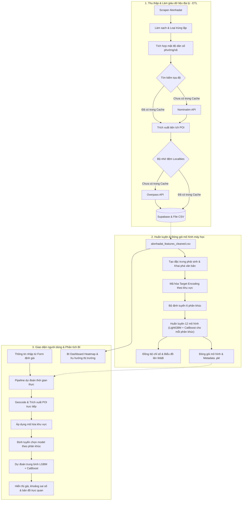

# 🏠 Mô Hình Định Giá Bất Động Sản Tự Động (AVM) - Tài Liệu Chuẩn Bị Thuyết Trình

Tài liệu này tổng hợp toàn bộ thông tin chi tiết về dự án để chuẩn bị cho buổi thuyết trình ngày mai. Nội dung bao gồm kiến trúc hệ thống, quy trình kỹ nghệ dữ liệu, các cải tiến mô hình máy học nổi bật, hệ thống ứng dụng thực tế và đề xuất cấu trúc slide thuyết trình.

---

## 🎯 Tóm Tắt Dự Án (Elevator Pitch)

* **Dự án là gì:** Hệ thống định giá bất động sản tự động (Automated Valuation Model - AVM) toàn diện dành riêng cho thị trường nhà đất tại Thành phố Hồ Chí Minh.
* **Bài toán giải quyết:** Định giá bất động sản tại Việt Nam gặp nhiều khó khăn do độ biến động giá rất lớn, dữ liệu phi cấu trúc, sự khác biệt cực kỳ lớn giữa phân khúc nhà mặt tiền và nhà trong hẻm, cũng như thiếu các đặc trưng địa lý rõ ràng.
* **Giải pháp:** Xây dựng một đường ống ETL tự động hóa, làm giàu dữ liệu bằng tọa độ địa lý và các địa điểm tiện ích (Points of Interest - POIs). Kết hợp với kiến trúc **phân mảnh 6-bucket** sử dụng mô hình ensemble tích hợp **LightGBM** và **CatBoost**.
* **Kết quả cốt lõi:** Đạt chỉ số **R² toàn cục là 0.9138** (giải thích được 91.38% mức độ biến động giá tại TP.HCM) và sai số phần trăm tuyệt đối trung bình **(MAPE) toàn cục chỉ 13.47%**. Đặc biệt ở phân khúc giá thấp (dưới 5 tỷ VND), sai số **MAPE đạt mức tối ưu 10.48%**.

---

## 🏗️ Kiến Trúc Hệ Thống

Hệ thống được chia làm ba cấu phần chính: **Thu thập & ETL Dữ liệu**, **Xây dựng & Huấn luyện Mô hình**, và **Ứng dụng Serving UI & BI**.

---

## 🔄 1. Đường Ống Dữ Liệu & ETL (`main.py`)

Quy trình ETL chạy tuần tự để thu thập dữ liệu bất động sản và làm giàu thông tin địa lý:

1. **Thu thập dữ liệu (Web Scraping):** Tự động cào dữ liệu từ trang `alonhadat.com.vn` theo từng trang danh sách, bóc tách các thông tin cơ bản (diện tích, giá, địa chỉ chi tiết, hướng nhà, số phòng ngủ, số tầng) cùng nội dung mô tả chi tiết.
2. **Làm sạch dữ liệu (`pipeline/transformation/cleaning.py`):**
   * Chuẩn hóa và dịch các trường dữ liệu tiếng Việt sang cấu trúc tiếng Anh thống nhất.
   * Xử lý trích xuất kích thước từ các đoạn văn tự do (ví dụ: chuyển đổi mô tả "ngang 5m dài 20m" thành các cột số thực tương ứng).
   * Chuyển đổi giá trị giá dạng chữ (như `20 triệu/m²` hoặc `15 tỷ`) về dạng số thực chuẩn (VND).
3. **Làm giàu thông tin nhân khẩu học:** Tích hợp diện tích hành chính và mật độ dân số cấp phường/xã của TP.HCM vào từng bản ghi bất động sản.
4. **Trích xuất thuộc tính địa lý & Caching:**
   * **Geocoding (Tìm tọa độ):** Xác định tọa độ `(vĩ độ, kinh độ)` từ địa chỉ thông qua cơ chế tra cứu phân cấp:
     1. Khớp chính xác địa chỉ cũ đã có trong cache.
     2. Khớp theo Đường + Phường/Xã trong bộ nhớ đệm.
     3. Truy vấn API Nominatim bên ngoài.
     4. Rơi về tọa độ trung tâm phường/xã (Centroid) nếu các bước trên thất bại.
   * **Trích xuất thông tin POI (`overpass_client.py`):** Truy vấn dữ liệu bản đồ OpenStreetMap qua Overpass API để tính toán khoảng cách đến các tiện ích thiết yếu:
     * **6 nhóm tiện ích:** Trường học, Bệnh viện, Chợ, Siêu thị, Trung tâm thương mại, Trạm xe buýt.
     * **Thuộc tính tính toán:** Khoảng cách đến địa điểm gần nhất và số lượng tiện ích xung quanh trong bán kính xác định (ví dụ: số bệnh viện trong 5km, trạm xe buýt trong 1km).
     * **Giao thông công cộng:** Tính toán số lượng ga tàu điện ngầm (metro) trong bán kính 5km.
   * **Bộ nhớ đệm địa lý (Caching):** Cơ chế lưu bộ nhớ đệm 2 lớp (tệp lưu trữ `localities.csv` + Dictionary trên RAM) giúp truy vấn tức thì (< 1ms) đối với các vị trí đã biết, bảo vệ giới hạn rate limit của API.
5. **Lưu trữ đám mây Supabase:** Dữ liệu hoàn thiện cuối cùng tự động được đẩy lên cơ sở dữ liệu Supabase (`Raw_Features`).

---

## 🧠 2. Phát Triển & Huấn Luyện Mô Hình (`train_xgboost.py`)

Việc huấn luyện một mô hình duy nhất cho toàn thành phố sẽ làm giảm độ chính xác do phân phối giá của nhà mặt tiền và nhà trong hẻm hoàn toàn khác biệt.

### Kiến Trúc Định Tuyến 6 Phân Khúc (6-Bucket Ensemble)
Để giảm sai số tối đa, tập dữ liệu được phân chia thành **6 phân khúc nhỏ chuyên biệt** trong cả quá trình huấn luyện lẫn dự đoán:

$$\text{Phân khúc} = \{\text{Thấp, Trung bình, Cao}\} \times \{\text{Nhà mặt tiền, Nhà trong hẻm}\}$$

* **Phân loại loại hình bất động sản:** Nhà trong hẻm vs. Nhà mặt tiền.
* **Phân loại tầm giá:** Thấp (Dưới 5 tỷ VND), Trung bình (5 - 20 tỷ VND), và Cao (Trên 20 tỷ VND).

Trong từng phân khúc, một mô hình ensemble kết hợp **LightGBM** và **CatBoost** sẽ được huấn luyện độc lập trên mục tiêu giá đã biến đổi logarit (`log1p`).

### Cải Tiến Lọc Ngoại Lai (The "IQR Breakthrough")
Thay vì áp dụng một ngưỡng lọc ngoại lai chung cho toàn bộ tập dữ liệu, dự án đã tùy chỉnh khoảng lọc Interquartile Range (IQR) tối ưu cho từng phân khúc:
* **Nhà trong hẻm (`nha_trong_hem`):** Sử dụng lọc **IQR x3.0** tiêu chuẩn. Phân phối phân khúc này tương đối tập trung, giữ lại 1,595 bản ghi sạch.
* **Nhà mặt tiền (`nha_mat_tien`):** Phân khúc này có phân phối lệch phải rất mạnh với đuôi luxury kéo dài (từ 120 tỷ lên đến 1,100 tỷ VND). Việc áp dụng bộ lọc chặt chẽ **IQR x1.5** (giới hạn trần ở mức **125 tỷ VND / diện tích 427 m²**) là một bước đột phá lớn.
* > [!IMPORTANT]
  > **Bước đột phá IQR:** Trước khi lọc chặt chẽ IQR x1.5 cho nhà mặt tiền, mô hình phân khúc này có sai số **MAPE lên tới 107%** (không thể sử dụng). Sau khi loại bỏ chiếc đuôi siêu sang gây nhiễu, MAPE của nhà mặt tiền giảm mạnh xuống chỉ còn **26.58%**.

### Kỹ Nghệ Đặc Trưng Độc Đáo
* **Chỉ số địa lý tích hợp:**
  * **Location Score:** Đánh giá độ thuận lợi vị trí dựa trên khoảng cách tới trung tâm TP.HCM, trường học, bệnh viện, trung tâm thương mại.
  * **Amenity Score:** Tổng hợp mật độ các tiện ích xung quanh trong các bán kính tiêu chuẩn.
* **Khai phá văn bản (Text Mining):**
  Quét nội dung tiêu đề và mô tả bài đăng để tạo ra các đặc trưng nhị phân quan trọng:
  * `is_hem_xe_hoi` (Hẻm lớn, xe hơi vào được)
  * `is_no_hau` (Nhà nở hậu - yếu tố phong thủy rất được ưa chuộng tại Việt Nam)
  * `has_noi_that` (Nhà có sẵn nội thất)
  * `is_gap` (Chủ nhà cần bán gấp hạ giá)
  * `is_kinh_doanh` (Vị trí tiện kinh doanh hoặc cho thuê sinh dòng tiền)
* **Target Encoding theo khu vực (`save_meta.py`):**
  Tính toán giá trung vị (`locality_price_median`) và giá mỗi m² trung vị (`price_per_sqm_market`) của từng Phường/Xã trên tập huấn luyện, lưu trữ vào tệp `ensemble_meta.pkl` nhằm nắm bắt biến động địa lý mà không làm rò rỉ dữ liệu (target leakage).

---

## 📈 3. Chỉ Số Hiệu Năng & Bảng Xếp Hạng

Tất cả các lượt huấn luyện, độ quan trọng đặc trưng (feature importance) và biểu đồ tương quan dự báo đều được theo dõi trực quan trên hệ thống Weights & Biases (W&B):

| Mô hình | Phân khúc dữ liệu | Ngưỡng lọc ngoại lai | R² Score | MAPE (%) | RMSE (log) |
|---|---|---|---|---|---|
| **TabPFN** (Tham chiếu) | `nha_trong_hem` (Hẻm) | IQR x3.0 | **0.8440** | **18.54%** | **0.2453** |
| **LightGBM + CatBoost** (Ensemble) | **Phân khúc thấp (0-5 tỷ)**| **N/A** | **-** | **10.48%** | **-** |
| **LightGBM + CatBoost** (Ensemble) | **Toàn bộ dữ liệu (Global)**| **Lọc theo phân khúc**| **0.9138** | **13.47%** | **-** |
| **TabPFN** (Tham chiếu) | Toàn bộ dữ liệu | IQR x3.0 | 0.8145 | 24.22% | 0.3185 |
| **LightGBM + CatBoost** (Ensemble) | **Phân khúc trung (5-20 tỷ)**| **N/A** | **-** | **14.10%** | **-** |
| **TabPFN** (Tham chiếu) | `nha_mat_tien` (Mặt tiền) | IQR x1.5 | **0.7036** | **26.58%** | **0.3439** |

* **Độ chính xác dự báo toàn cục ($R^2$):** Đạt **0.9138**, tức mô hình giải thích được 91.38% sự biến động giá nhà tại TP.HCM.
* **Sai số trung bình (MAPE):** MAPE toàn cục đạt **13.47%**. Đặc biệt đối với phân khúc giá thấp (dưới 5 tỷ VND - phân khúc phổ biến nhất), sai số chỉ còn **10.48%**.

---

## 💻 4. Ứng Dụng Streamlit UI & Serving (`app/app.py`)

Ứng dụng phục vụ hai nhóm nghiệp vụ chính:

### A. Dashboard Phân Tích Thị Trường (BI)
* Hiển thị nhanh các thông tin tổng quan của cơ sở dữ liệu bất động sản (tổng số lượng tin đăng, giá trung vị, giá/m² trung vị).
* Biểu diễn bản đồ nhiệt (Heatmap) về mức giá/m² thông qua thư viện **PyDeck (HeatmapLayer)** giúp nhận diện các khu vực có giá trị bất động sản cao.
* Biểu đồ trực quan hóa xu hướng giá và lượng tin đăng qua các tháng, kèm danh sách 10 phường/xã đắt đỏ nhất.

### B. Form Định Giá Bất Động Sản Trực Tuyến
* **Geocoding thời gian thực:** Tự động lấy tọa độ của địa chỉ người dùng nhập vào.
* **Truy vấn POI tức thời:** Nếu tọa độ nằm ngoài vùng đã cào dữ liệu trước đó, ứng dụng sẽ gọi API Overpass OSM để tính toán khoảng cách đến trường học, bệnh viện, metro... và ghi đè lưu trữ vào cache cho lần sau.
* **Dự báo phân mảnh thông minh:**
  1. Người dùng nhập thông số nhà đất và lựa chọn tầm giá dự kiến (`dưới 5 tỷ`, `5-20 tỷ`, `trên 20 tỷ`) cùng loại hình nhà mặt tiền/hẻm.
  2. Ứng dụng tự động tải và liên kết các mô hình LightGBM (`lgbm_*.pkl`) và CatBoost (`cb_*.pkl`) tương ứng của phân khúc đó.
  3. Giá trị dự báo trên thang đo logarit của hai mô hình được tính trung bình cộng, sau đó mũ hóa ngược lại để trả về giá trị VND thực tế.
* **Đầu ra trực quan:** Hiển thị giá dự đoán (tỷ VND), khoảng giá tham khảo khuyến nghị dựa trên sai số MAPE toàn cục, đơn giá mỗi m², và định vị vị trí nhà đất trên bản đồ trực quan.

---

## 🗣️ Đề Xuất Cấu Trúc Slide Thuyết Trình (10 Slides)

Dưới đây là dàn bài 10 slide được thiết kế chuyên nghiệp phục vụ cho buổi thuyết trình ngày mai:

### Slide 1: Giới thiệu dự án
* **Tiêu đề:** Hệ thống Định giá Bất động sản Tự động (AVM) tại TP.HCM
* **Tiêu đề phụ:** Ứng dụng Kiến trúc Phân mảnh 6-Bucket Ensemble (MAPE Toàn cục: 13.47%)
* **Người thực hiện & Ngày báo cáo**

### Slide 2: Thách thức của thị trường Bất động sản Việt Nam
* **Sự phân hóa cực đoan:** Phân phối giá trị và đặc tính của nhà mặt tiền khác biệt hoàn toàn với nhà trong hẻm.
* **Khoảng trống dữ liệu:** Thiếu tọa độ địa lý, thông tin kích thước ẩn trong văn bản tự do, thiếu các đặc trưng tiện ích xung quanh.
* **Mục tiêu:** Xây dựng mô hình định giá đáng tin cậy với sai số MAPE dưới 15%.

### Slide 3: Kiến trúc Hệ thống AVM
* *Trực quan hóa bằng sơ đồ kiến trúc hệ thống (Mermaid diagram ở trên).*
* **3 giai đoạn chính:** Quy trình ETL địa lý ➔ Huấn luyện mô hình chuyên biệt ➔ Phục vụ định giá thời gian thực.

### Slide 4: Quy trình ETL & Làm giàu dữ liệu địa lý
* **Bóc tách dữ liệu:** Scraper tự động hóa bóc tách thông tin thô từ Alonhadat.
* **Làm giàu đặc trưng:** Kết nối API Overpass OSM để đo đạc khoảng cách tới 6 nhóm tiện ích và hệ thống Metro.
* **Tối ưu hóa chi phí:** Tích hợp bộ nhớ đệm 2 lớp giúp tốc độ truy vấn địa lý đạt dưới `1ms` cho phần lớn trường hợp.

### Slide 5: Bước đột phá IQR & Phân mảnh dữ liệu
* **Tại sao cần phân tách?** Giá nhà mặt tiền trung vị (~32 tỷ VND) gấp nhiều lần nhà trong hẻm (~9.5 tỷ VND).
* **Chiến lược lọc ngoại lai:** Sử dụng IQR x3.0 cho nhà trong hẻm và IQR x1.5 cho nhà mặt tiền để cắt đuôi phân phối siêu sang (trên 125 tỷ VND).
* **Kết quả vượt bậc:** MAPE của nhà mặt tiền giảm từ **107%** (không thể dùng) xuống mức chấp nhận được là **26.58%**.

### Slide 6: Kiến trúc 6-Bucket & Đặc trưng tự chọn
* **Bộ định tuyến 6 phân khúc:** Tách biệt huấn luyện cho (Thấp/Trung/Cao) $\times$ (Nhà mặt tiền/Hẻm) sử dụng LightGBM và CatBoost.
* **Kỹ nghệ đặc trưng:**
  * Mã hóa target encoding cấp phường/xã (`locality_price_median`).
  * Khai phá thông tin đặc biệt từ văn bản (`is_hem_xe_hoi`, `is_no_hau`, `is_kinh_doanh`).
  * Điểm vị trí và điểm tiện ích tích hợp (`location_score`, `amenity_score`).

### Slide 7: Hiệu năng & Kết quả mô hình
* *Hiển thị bảng xếp hạng so sánh chỉ số R² và MAPE giữa các mô hình.*
* **Chỉ số toàn cục:** Hệ số xác định $R^2$ đạt **0.9138** và sai số phần trăm MAPE đạt **13.47%**.
* **Điểm sáng:** Phân khúc giao dịch phổ thông (dưới 5 tỷ VND) đạt sai số thấp ấn tượng **10.48%**.

### Slide 8: Đồng bộ thí nghiệm bằng Weights & Biases (W&B)
* Đảm bảo tính minh bạch và khả năng tái lập của nghiên cứu.
* **Công cụ W&B:** Theo dõi tự động mọi lượt chạy, lưu trữ độ quan trọng của đặc trưng và biểu đồ so sánh thực tế - dự báo.
* **Lợi ích:** Giúp nhóm dự án và các bên liên quan dễ dàng kiểm định hiệu năng mô hình từ xa.

### Slide 9: Ứng dụng thực tế: BI Dashboard & Form Định giá
* **Dashboard BI:** Hỗ trợ trực quan hóa bản đồ nhiệt giá/m² bằng PyDeck cùng xu hướng thị trường.
* **Ứng dụng định giá:** Người dùng chỉ cần nhập địa chỉ và thông số cơ bản để nhận định giá chính xác và tọa độ thực tế trên bản đồ.

### Slide 10: Tổng kết & Định hướng tương lai
* **Thành tựu:** Triển khai thành công ứng dụng thực tế, giải quyết được sự biến động giá phức tạp nhờ chia nhỏ phân khúc, tối ưu hóa chi phí API nhờ bộ nhớ đệm.
* **Định hướng phát triển:**
  * Áp dụng truy vấn không đồng bộ (Async) Overpass API để tối ưu tốc độ ETL.
  * Tích hợp CI/CD và giám sát chất lượng dữ liệu đầu vào.
  * Mở rộng mô hình ra thị trường Hà Nội và Đà Nẵng.
